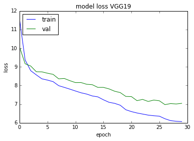
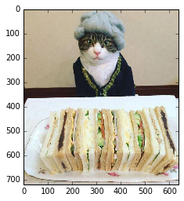

# Artificial Intelligence Nanodegree

## Convolutional Neural Networks

## Project: Write an Algorithm for a Dog Identification App 

```python
img_path = './test_images/8.jpg'
classify_image(img_path)
```

    Using image path ./test_images/8.jpg
    Human detected
    131
    ./test_images/8.jpg
    Dear human, your dog breed is Xoloitzcuintli for image None
    


---

In this notebook, some template code has already been provided for you, and you will need to implement additional functionality to successfully complete this project. You will not need to modify the included code beyond what is requested. Sections that begin with **'(IMPLEMENTATION)'** in the header indicate that the following block of code will require additional functionality which you must provide. Instructions will be provided for each section, and the specifics of the implementation are marked in the code block with a 'TODO' statement. Please be sure to read the instructions carefully! 

> **Note**: Once you have completed all of the code implementations, you need to finalize your work by exporting the iPython Notebook as an HTML document. Before exporting the notebook to html, all of the code cells need to have been run so that reviewers can see the final implementation and output. You can then export the notebook by using the menu above and navigating to  \n",
    "**File -> Download as -> HTML (.html)**. Include the finished document along with this notebook as your submission.

In addition to implementing code, there will be questions that you must answer which relate to the project and your implementation. Each section where you will answer a question is preceded by a **'Question X'** header. Carefully read each question and provide thorough answers in the following text boxes that begin with **'Answer:'**. Your project submission will be evaluated based on your answers to each of the questions and the implementation you provide.

>**Note:** Code and Markdown cells can be executed using the **Shift + Enter** keyboard shortcut.  Markdown cells can be edited by double-clicking the cell to enter edit mode.

The rubric contains _optional_ "Stand Out Suggestions" for enhancing the project beyond the minimum requirements. If you decide to pursue the "Stand Out Suggestions", you should include the code in this IPython notebook.


---
### Why We're Here 

In this notebook, you will make the first steps towards developing an algorithm that could be used as part of a mobile or web app.  At the end of this project, your code will accept any user-supplied image as input.  If a dog is detected in the image, it will provide an estimate of the dog's breed.  If a human is detected, it will provide an estimate of the dog breed that is most resembling.  The image below displays potential sample output of your finished project (... but we expect that each student's algorithm will behave differently!). 


In this real-world setting, you will need to piece together a series of models to perform different tasks; for instance, the algorithm that detects humans in an image will be different from the CNN that infers dog breed.  There are many points of possible failure, and no perfect algorithm exists.  Your imperfect solution will nonetheless create a fun user experience!

### The Road Ahead

We break the notebook into separate steps.  Feel free to use the links below to navigate the notebook.

* [Step 0](#step0): Import Datasets
* [Step 1](#step1): Detect Humans
* [Step 2](#step2): Detect Dogs
* [Step 3](#step3): Create a CNN to Classify Dog Breeds (from Scratch)
* [Step 4](#step4): Use a CNN to Classify Dog Breeds (using Transfer Learning)
* [Step 5](#step5): Create a CNN to Classify Dog Breeds (using Transfer Learning)
* [Step 6](#step6): Write your Algorithm
* [Step 7](#step7): Test Your Algorithm

---
<a id='step0'></a>
## Step 0: Import Datasets

### Import Dog Dataset

In the code cell below, we import a dataset of dog images.  We populate a few variables through the use of the `load_files` function from the scikit-learn library:
- `train_files`, `valid_files`, `test_files` - numpy arrays containing file paths to images
- `train_targets`, `valid_targets`, `test_targets` - numpy arrays containing onehot-encoded classification labels 
- `dog_names` - list of string-valued dog breed names for translating labels


```python
from sklearn.datasets import load_files       
from keras.utils import np_utils
import numpy as np
from glob import glob

# sorted() needs to be used with glob! to have alphabetical order of dog names, otherwise labels are WRONG

# define function to load train, test, and validation datasets
def load_dataset(path):
    data = load_files(path)
    dog_files = np.array(data['filenames'])
    dog_targets = np_utils.to_categorical(np.array(data['target']), 133)
    return dog_files, dog_targets

# load train, test, and validation datasets
train_files, train_targets = load_dataset('dogImages/train')
valid_files, valid_targets = load_dataset('dogImages/valid')
test_files, test_targets = load_dataset('dogImages/test')

# load list of dog names
dog_names = [item[20:-1] for item in sorted(glob("dogImages/train/*/"))]

# print statistics about the dataset
print('There are %d total dog categories.' % len(dog_names))
print('There are %s total dog images.\n' % len(np.hstack([train_files, valid_files, test_files])))
print('There are %d training dog images.' % len(train_files))
print('There are %d validation dog images.' % len(valid_files))
print('There are %d test dog images.'% len(test_files))
```

    There are 133 total dog categories.
    There are 8351 total dog images.
    
    There are 6680 training dog images.
    There are 835 validation dog images.
    There are 836 test dog images.
    

### Import Human Dataset

In the code cell below, we import a dataset of human images, where the file paths are stored in the numpy array `human_files`.


```python
import random
random.seed(8675309)

# load filenames in shuffled human dataset
human_files = np.array(glob("lfw/*/*"))
random.shuffle(human_files)

# print statistics about the dataset
print('There are %d total human images.' % len(human_files))
```

    There are 13233 total human images.
    

---
<a id='step1'></a>
## Step 1: Detect Humans

We use OpenCV's implementation of [Haar feature-based cascade classifiers](http://docs.opencv.org/trunk/d7/d8b/tutorial_py_face_detection.html) to detect human faces in images.  OpenCV provides many pre-trained face detectors, stored as XML files on [github](https://github.com/opencv/opencv/tree/master/data/haarcascades).  We have downloaded one of these detectors and stored it in the `haarcascades` directory.

In the next code cell, we demonstrate how to use this detector to find human faces in a sample image.


```python
import cv2                
import matplotlib.pyplot as plt                        
%matplotlib inline                               

# extract pre-trained face detector
face_cascade = cv2.CascadeClassifier('haarcascades/haarcascade_frontalface_alt.xml')

# load color (BGR) image
img = cv2.imread(human_files[3])
# convert BGR image to grayscale
gray = cv2.cvtColor(img, cv2.COLOR_BGR2GRAY)

# find faces in image
faces = face_cascade.detectMultiScale(gray)

# print number of faces detected in the image
print('Number of faces detected:', len(faces))

# get bounding box for each detected face
for (x,y,w,h) in faces:
    # add bounding box to color image
    cv2.rectangle(img,(x,y),(x+w,y+h),(255,0,0),2)
    
# convert BGR image to RGB for plotting
cv_rgb = cv2.cvtColor(img, cv2.COLOR_BGR2RGB)

# display the image, along with bounding box
plt.imshow(cv_rgb)
plt.show()
```

    Number of faces detected: 1
    


Before using any of the face detectors, it is standard procedure to convert the images to grayscale.  The `detectMultiScale` function executes the classifier stored in `face_cascade` and takes the grayscale image as a parameter.  

In the above code, `faces` is a numpy array of detected faces, where each row corresponds to a detected face.  Each detected face is a 1D array with four entries that specifies the bounding box of the detected face.  The first two entries in the array (extracted in the above code as `x` and `y`) specify the horizontal and vertical positions of the top left corner of the bounding box.  The last two entries in the array (extracted here as `w` and `h`) specify the width and height of the box.

### Write a Human Face Detector

We can use this procedure to write a function that returns `True` if a human face is detected in an image and `False` otherwise.  This function, aptly named `face_detector`, takes a string-valued file path to an image as input and appears in the code block below.


```python
# returns "True" if face is detected in image stored at img_path
def face_detector(img_path):
    img = cv2.imread(img_path)
    gray = cv2.cvtColor(img, cv2.COLOR_BGR2GRAY)
    faces = face_cascade.detectMultiScale(gray)
    return len(faces) > 0
```

### (IMPLEMENTATION) Assess the Human Face Detector

__Question 1:__ Use the code cell below to test the performance of the `face_detector` function.  
- What percentage of the first 100 images in `human_files` have a detected human face?  
- What percentage of the first 100 images in `dog_files` have a detected human face? 

Ideally, we would like 100% of human images with a detected face and 0% of dog images with a detected face.  You will see that our algorithm falls short of this goal, but still gives acceptable performance.  We extract the file paths for the first 100 images from each of the datasets and store them in the numpy arrays `human_files_short` and `dog_files_short`.

__Answer:__ The Haar Cascade is able to identify humans by face recognition. It identifies 96% of humans correctly, but the false negative recognition rate  is 4 % and the false positive recognition rate for dogs is 11%. 
Generally Haar Cascade just searches for the presence of "face like" structures, which can be present in any kind of image and is not really robust or meant to identify "humans". A face is just one possible feature of a human.


```python
human_files_short = human_files[:100]
dog_files_short = train_files[:100]
# Do NOT modify the code above this line.

## TODO: Test the performance of the face_detector algorithm 
## on the images in human_files_short and dog_files_short.

# extract pre-trained face detector
face_cascade = cv2.CascadeClassifier('haarcascades/haarcascade_frontalface_alt.xml')
found_human = 0    
for i in range(len(human_files_short)):                              

    found_human += face_detector(human_files_short[i])
    
print("Found", found_human, "faces out of", len(human_files_short), "human images, which is", (found_human/len(human_files_short))*100, "%")

found_dog = 0    
for i in range(len(dog_files_short)):                              

    found_dog += face_detector(dog_files_short[i])
    
print("Found", found_dog, "faces out of", len(dog_files_short), "dog images, which is", (found_dog/len(dog_files_short))*100, "%")

```

    Found 96 faces out of 100 human images, which is 96.0 %
    Found 11 faces out of 100 dog images, which is 11.0 %
    

__Question 2:__ This algorithmic choice necessitates that we communicate to the user that we accept human images only when they provide a clear view of a face (otherwise, we risk having unneccessarily frustrated users!). In your opinion, is this a reasonable expectation to pose on the user? If not, can you think of a way to detect humans in images that does not necessitate an image with a clearly presented face?

__Answer:__ The exposure of a face is not a really robust expectation, also the face has to be large enough and form a straight view point. It would be more reasonable to identify humans based on body shapes and legs/torso/head features, such as size, proportion or shape.

We suggest the face detector from OpenCV as a potential way to detect human images in your algorithm, but you are free to explore other approaches, especially approaches that make use of deep learning :).  Please use the code cell below to design and test your own face detection algorithm.  If you decide to pursue this _optional_ task, report performance on each of the datasets.


```python
## (Optional) TODO: Report the performance of another  
## face detection algorithm on the LFW dataset
### Feel free to use as many code cells as needed.


```

---
<a id='step2'></a>
## Step 2: Detect Dogs

In this section, we use a pre-trained [ResNet-50](http://ethereon.github.io/netscope/#/gist/db945b393d40bfa26006) model to detect dogs in images.  Our first line of code downloads the ResNet-50 model, along with weights that have been trained on [ImageNet](http://www.image-net.org/), a very large, very popular dataset used for image classification and other vision tasks.  ImageNet contains over 10 million URLs, each linking to an image containing an object from one of [1000 categories](https://gist.github.com/yrevar/942d3a0ac09ec9e5eb3a).  Given an image, this pre-trained ResNet-50 model returns a prediction (derived from the available categories in ImageNet) for the object that is contained in the image.


```python
from keras.applications.resnet50 import ResNet50

# define ResNet50 model
ResNet50_model = ResNet50(weights='imagenet')
```

### Pre-process the Data

When using TensorFlow as backend, Keras CNNs require a 4D array (which we'll also refer to as a 4D tensor) as input, with shape

$$
(\text{nb_samples}, \text{rows}, \text{columns}, \text{channels}),
$$

where `nb_samples` corresponds to the total number of images (or samples), and `rows`, `columns`, and `channels` correspond to the number of rows, columns, and channels for each image, respectively.  

The `path_to_tensor` function below takes a string-valued file path to a color image as input and returns a 4D tensor suitable for supplying to a Keras CNN.  The function first loads the image and resizes it to a square image that is $224 \times 224$ pixels.  Next, the image is converted to an array, which is then resized to a 4D tensor.  In this case, since we are working with color images, each image has three channels.  Likewise, since we are processing a single image (or sample), the returned tensor will always have shape

$$
(1, 224, 224, 3).
$$

The `paths_to_tensor` function takes a numpy array of string-valued image paths as input and returns a 4D tensor with shape 

$$
(\text{nb_samples}, 224, 224, 3).
$$

Here, `nb_samples` is the number of samples, or number of images, in the supplied array of image paths.  It is best to think of `nb_samples` as the number of 3D tensors (where each 3D tensor corresponds to a different image) in your dataset!


```python
from keras.preprocessing import image                  
from tqdm import tqdm

def path_to_tensor(img_path):
    # loads RGB image as PIL.Image.Image type
    img = image.load_img(img_path, target_size=(224, 224))
    # convert PIL.Image.Image type to 3D tensor with shape (224, 224, 3)
    x = image.img_to_array(img)
    # convert 3D tensor to 4D tensor with shape (1, 224, 224, 3) and return 4D tensor
    return np.expand_dims(x, axis=0)

def paths_to_tensor(img_paths):
    list_of_tensors = [path_to_tensor(img_path) for img_path in tqdm(img_paths)]
    return np.vstack(list_of_tensors)
```

### Making Predictions with ResNet-50

Getting the 4D tensor ready for ResNet-50, and for any other pre-trained model in Keras, requires some additional processing.  First, the RGB image is converted to BGR by reordering the channels.  All pre-trained models have the additional normalization step that the mean pixel (expressed in RGB as $[103.939, 116.779, 123.68]$ and calculated from all pixels in all images in ImageNet) must be subtracted from every pixel in each image.  This is implemented in the imported function `preprocess_input`.  If you're curious, you can check the code for `preprocess_input` [here](https://github.com/fchollet/keras/blob/master/keras/applications/imagenet_utils.py).

Now that we have a way to format our image for supplying to ResNet-50, we are now ready to use the model to extract the predictions.  This is accomplished with the `predict` method, which returns an array whose $i$-th entry is the model's predicted probability that the image belongs to the $i$-th ImageNet category.  This is implemented in the `ResNet50_predict_labels` function below.

By taking the argmax of the predicted probability vector, we obtain an integer corresponding to the model's predicted object class, which we can identify with an object category through the use of this [dictionary](https://gist.github.com/yrevar/942d3a0ac09ec9e5eb3a). 


```python
from keras.applications.resnet50 import preprocess_input, decode_predictions

def ResNet50_predict_labels(img_path):
    # returns prediction vector for image located at img_path
    img = preprocess_input(path_to_tensor(img_path))
    return np.argmax(ResNet50_model.predict(img))
```

### Write a Dog Detector

While looking at the [dictionary](https://gist.github.com/yrevar/942d3a0ac09ec9e5eb3a), you will notice that the categories corresponding to dogs appear in an uninterrupted sequence and correspond to dictionary keys 151-268, inclusive, to include all categories from `'Chihuahua'` to `'Mexican hairless'`.  Thus, in order to check to see if an image is predicted to contain a dog by the pre-trained ResNet-50 model, we need only check if the `ResNet50_predict_labels` function above returns a value between 151 and 268 (inclusive).

We use these ideas to complete the `dog_detector` function below, which returns `True` if a dog is detected in an image (and `False` if not).


```python
### returns "True" if a dog is detected in the image stored at img_path
def dog_detector(img_path):
    prediction = ResNet50_predict_labels(img_path)
    return ((prediction <= 268) & (prediction >= 151)) 
```

### (IMPLEMENTATION) Assess the Dog Detector

__Question 3:__ Use the code cell below to test the performance of your `dog_detector` function.  
- What percentage of the images in `human_files_short` have a detected dog?  
- What percentage of the images in `dog_files_short` have a detected dog?

__Answer:__ The CNN is quite perfect, it Found 0 dogs out of 100 human images, which is 100.0 % correct
and found 100 dogs out of 100 dog images, which is 100.0 % correct.


```python
### TODO: Test the performance of the dog_detector function
### on the images in human_files_short and dog_files_short.

# extract pre-trained face detector
face_cascade = cv2.CascadeClassifier('haarcascades/haarcascade_frontalface_alt.xml')
found_human = 0    
for i in range(len(human_files_short)):                              

    found_human += dog_detector(human_files_short[i])
    
print("Found", found_human, "dogs out of", len(human_files_short), "human images, which is", (found_human/len(human_files_short))*100, "%")

found_dog = 0    
for i in range(len(dog_files_short)):                              

    found_dog += dog_detector(dog_files_short[i])
    
print("Found", found_dog, "dogs out of", len(dog_files_short), "dog images, which is", (found_dog/len(dog_files_short))*100, "%")

```

    Found 0 dogs out of 100 human images, which is 0.0 %
    Found 100 dogs out of 100 dog images, which is 100.0 %
    

---
<a id='step3'></a>
## Step 3: Create a CNN to Classify Dog Breeds (from Scratch)

Now that we have functions for detecting humans and dogs in images, we need a way to predict breed from images.  In this step, you will create a CNN that classifies dog breeds.  You must create your CNN _from scratch_ (so, you can't use transfer learning _yet_!), and you must attain a test accuracy of at least 1%.  In Step 5 of this notebook, you will have the opportunity to use transfer learning to create a CNN that attains greatly improved accuracy.

Be careful with adding too many trainable layers!  More parameters means longer training, which means you are more likely to need a GPU to accelerate the training process.  Thankfully, Keras provides a handy estimate of the time that each epoch is likely to take; you can extrapolate this estimate to figure out how long it will take for your algorithm to train. 

We mention that the task of assigning breed to dogs from images is considered exceptionally challenging.  To see why, consider that *even a human* would have great difficulty in distinguishing between a Brittany and a Welsh Springer Spaniel.  

Brittany | Welsh Springer Spaniel
- | - 
 | 

It is not difficult to find other dog breed pairs with minimal inter-class variation (for instance, Curly-Coated Retrievers and American Water Spaniels).  

Curly-Coated Retriever | American Water Spaniel
- | -
 | 


Likewise, recall that labradors come in yellow, chocolate, and black.  Your vision-based algorithm will have to conquer this high intra-class variation to determine how to classify all of these different shades as the same breed.  

Yellow Labrador | Chocolate Labrador | Black Labrador
- | -
 |  | 

We also mention that random chance presents an exceptionally low bar: setting aside the fact that the classes are slightly imabalanced, a random guess will provide a correct answer roughly 1 in 133 times, which corresponds to an accuracy of less than 1%.  

Remember that the practice is far ahead of the theory in deep learning.  Experiment with many different architectures, and trust your intuition.  And, of course, have fun! 

### Pre-process the Data

We rescale the images by dividing every pixel in every image by 255.


```python
from PIL import ImageFile                            
ImageFile.LOAD_TRUNCATED_IMAGES = True                 

# pre-process the data for Keras
train_tensors = paths_to_tensor(train_files).astype('float32')/255
valid_tensors = paths_to_tensor(valid_files).astype('float32')/255
test_tensors = paths_to_tensor(test_files).astype('float32')/255
```

    100%|██████████| 6680/6680 [01:28<00:00, 75.34it/s]
    100%|██████████| 835/835 [04:32<00:00,  6.28it/s]
    100%|██████████| 836/836 [00:25<00:00, 33.34it/s]
    

### (IMPLEMENTATION) Model Architecture

Create a CNN to classify dog breed.  At the end of your code cell block, summarize the layers of your model by executing the line:
    
        model.summary()

We have imported some Python modules to get you started, but feel free to import as many modules as you need.  If you end up getting stuck, here's a hint that specifies a model that trains relatively fast on CPU and attains >1% test accuracy in 5 epochs:


           
__Question 4:__ Outline the steps you took to get to your final CNN architecture and your reasoning at each step.  If you chose to use the hinted architecture above, describe why you think that CNN architecture should work well for the image classification task.

__Answer:__ I chose to use LeNet architecture. Lenet is known to handle datasets categorization, such as letters in MNIST really well, yet is small, has few parameters and there able to train on just a few images. Also I used a GPU to speed up training significantly, reaching close to 5%.


```python
from keras.layers import Conv2D, MaxPooling2D, GlobalAveragePooling2D
from keras.layers import Dropout, Flatten, Dense
from keras.models import Sequential

### TODO: Define your architecture.
# Using LeNet architecture, as it is small, yet proven to work

# Define input shape
input_shape = (224, 224, 3)

# Define number of classes
num_classes = 133

# Define model
model = Sequential()

model.add(Conv2D(32, kernel_size=(3, 3),
                 activation='relu',
                 input_shape=input_shape))

model.add(Conv2D(64, (3, 3), activation='relu'))
model.add(MaxPooling2D(pool_size=(2, 2)))
model.add(Dropout(0.25))
model.add(Flatten())
model.add(Dense(128, activation='relu'))
model.add(Dropout(0.5))
model.add(Dense(num_classes, activation='softmax'))

# Print model summary
model.summary()

```

    _________________________________________________________________
    Layer (type)                 Output Shape              Param #   
    =================================================================
    conv2d_1 (Conv2D)            (None, 222, 222, 32)      896       
    _________________________________________________________________
    conv2d_2 (Conv2D)            (None, 220, 220, 64)      18496     
    _________________________________________________________________
    max_pooling2d_20 (MaxPooling (None, 110, 110, 64)      0         
    _________________________________________________________________
    dropout_1 (Dropout)          (None, 110, 110, 64)      0         
    _________________________________________________________________
    flatten_2 (Flatten)          (None, 774400)            0         
    _________________________________________________________________
    dense_3 (Dense)              (None, 128)               99123328  
    _________________________________________________________________
    dropout_2 (Dropout)          (None, 128)               0         
    _________________________________________________________________
    dense_4 (Dense)              (None, 133)               17157     
    =================================================================
    Total params: 99,159,877
    Trainable params: 99,159,877
    Non-trainable params: 0
    _________________________________________________________________
    

### Compile the Model


```python
model.compile(optimizer='rmsprop', loss='categorical_crossentropy', metrics=['accuracy'])
```

### (IMPLEMENTATION) Train the Model

Train your model in the code cell below.  Use model checkpointing to save the model that attains the best validation loss.

You are welcome to [augment the training data](https://blog.keras.io/building-powerful-image-classification-models-using-very-little-data.html), but this is not a requirement. 


```python
from keras.callbacks import ModelCheckpoint  

### TODO: specify the number of epochs that you would like to use to train the model.

epochs = 3

### Do NOT modify the code below this line.

checkpointer = ModelCheckpoint(filepath='saved_models/weights.best.from_scratch.hdf5', 
                               verbose=1, save_best_only=True)

model.fit(train_tensors, train_targets, 
          validation_data=(valid_tensors, valid_targets),
          epochs=epochs, batch_size=20, callbacks=[checkpointer], verbose=1)
```

    Train on 6680 samples, validate on 835 samples
    Epoch 1/3
    6660/6680 [============================>.] - ETA: 0s - loss: 6.0428 - acc: 0.0105Epoch 00000: val_loss improved from inf to 4.78954, saving model to saved_models/weights.best.from_scratch.hdf5
    6680/6680 [==============================] - 126s - loss: 6.0389 - acc: 0.0105 - val_loss: 4.7895 - val_acc: 0.0168
    Epoch 2/3
    6660/6680 [============================>.] - ETA: 0s - loss: 4.7239 - acc: 0.0330Epoch 00001: val_loss improved from 4.78954 to 4.66055, saving model to saved_models/weights.best.from_scratch.hdf5
    6680/6680 [==============================] - 100s - loss: 4.7243 - acc: 0.0332 - val_loss: 4.6605 - val_acc: 0.0431
    Epoch 3/3
    6660/6680 [============================>.] - ETA: 0s - loss: 4.0870 - acc: 0.1192Epoch 00002: val_loss improved from 4.66055 to 4.60841, saving model to saved_models/weights.best.from_scratch.hdf5
    6680/6680 [==============================] - 100s - loss: 4.0878 - acc: 0.1190 - val_loss: 4.6084 - val_acc: 0.0503
    


    <keras.callbacks.History at 0x7f25b2046320>


### Load the Model with the Best Validation Loss


```python
model.load_weights('saved_models/weights.best.from_scratch.hdf5')
```

### Test the Model

Try out your model on the test dataset of dog images.  Ensure that your test accuracy is greater than 1%.


```python
# get index of predicted dog breed for each image in test set
dog_breed_predictions = [np.argmax(model.predict(np.expand_dims(tensor, axis=0))) for tensor in test_tensors]

# report test accuracy
test_accuracy = 100*np.sum(np.array(dog_breed_predictions)==np.argmax(test_targets, axis=1))/len(dog_breed_predictions)
print('Test accuracy: %.4f%%' % test_accuracy)
```

    Test accuracy: 4.5455%
    

---
<a id='step4'></a>
## Step 4: Use a CNN to Classify Dog Breeds

To reduce training time without sacrificing accuracy, we show you how to train a CNN using transfer learning.  In the following step, you will get a chance to use transfer learning to train your own CNN.

### Obtain Bottleneck Features


```python
bottleneck_features = np.load('bottleneck_features/DogVGG16Data.npz')
train_VGG16 = bottleneck_features['train']
valid_VGG16 = bottleneck_features['valid']
test_VGG16 = bottleneck_features['test']
```

### Model Architecture

The model uses the the pre-trained VGG-16 model as a fixed feature extractor, where the last convolutional output of VGG-16 is fed as input to our model.  We only add a global average pooling layer and a fully connected layer, where the latter contains one node for each dog category and is equipped with a softmax.


```python
from keras.layers import Conv2D, MaxPooling2D, GlobalAveragePooling2D
from keras.layers import Dropout, Flatten, Dense
from keras.models import Sequential

VGG16_model = Sequential()
VGG16_model.add(GlobalAveragePooling2D(input_shape=train_VGG16.shape[1:]))
VGG16_model.add(Dense(133, activation='softmax'))

VGG16_model.summary()
```

    _________________________________________________________________
    Layer (type)                 Output Shape              Param #   
    =================================================================
    global_average_pooling2d_1 ( (None, 512)               0         
    _________________________________________________________________
    dense_3 (Dense)              (None, 133)               68229     
    =================================================================
    Total params: 68,229
    Trainable params: 68,229
    Non-trainable params: 0
    _________________________________________________________________
    

### Compile the Model


```python
VGG16_model.compile(loss='categorical_crossentropy', optimizer='rmsprop', metrics=['accuracy'])
```

### Train the Model


```python
from keras.callbacks import ModelCheckpoint  

# Create checkpoints to keep best model weights
checkpointer = ModelCheckpoint(filepath='saved_models/weights.best.VGG16.hdf5', 
                               verbose=1, save_best_only=True)

# Save a training history for visualization
history = VGG16_model.fit(train_VGG16, train_targets, 
          validation_data=(valid_VGG16, valid_targets),
          epochs=30, batch_size=20, callbacks=[checkpointer], verbose=1)

# list all data in history
print(history.history.keys())

# summarize history for accuracy
plt.plot(history.history['acc'])
plt.plot(history.history['val_acc'])
plt.title('VGG16 model accuracy')
plt.ylabel('accuracy')
plt.xlabel('epoch')
plt.legend(['train', 'val'], loc='upper left')
plt.savefig('VGG16_model_accuracy.png', bbox_inches='tight')
plt.show()

# summarize history for loss
plt.plot(history.history['loss'])
plt.plot(history.history['val_loss'])
plt.title('VGG16 model loss')
plt.ylabel('loss')
plt.xlabel('epoch')
plt.legend(['train', 'val'], loc='upper left')
plt.savefig('VGG16_model_loss.png', bbox_inches='tight')
plt.show()
```

    Train on 6680 samples, validate on 835 samples
    Epoch 1/30
    6600/6680 [============================>.] - ETA: 0s - loss: 12.8128 - acc: 0.1023Epoch 00000: val_loss improved from inf to 11.23124, saving model to saved_models/weights.best.VGG16.hdf5
    6680/6680 [==============================] - 4s - loss: 12.8097 - acc: 0.1027 - val_loss: 11.2312 - val_acc: 0.1976
    Epoch 2/30
    6640/6680 [============================>.] - ETA: 0s - loss: 10.7033 - acc: 0.2498Epoch 00001: val_loss improved from 11.23124 to 10.56280, saving model to saved_models/weights.best.VGG16.hdf5
    6680/6680 [==============================] - 3s - loss: 10.7129 - acc: 0.2494 - val_loss: 10.5628 - val_acc: 0.2647
    Epoch 3/30
    6660/6680 [============================>.] - ETA: 0s - loss: 10.1860 - acc: 0.3114Epoch 00002: val_loss improved from 10.56280 to 10.27150, saving model to saved_models/weights.best.VGG16.hdf5
    6680/6680 [==============================] - 3s - loss: 10.1924 - acc: 0.3111 - val_loss: 10.2715 - val_acc: 0.2970
    Epoch 4/30
    6600/6680 [============================>.] - ETA: 0s - loss: 10.0147 - acc: 0.3376Epoch 00003: val_loss improved from 10.27150 to 10.24045, saving model to saved_models/weights.best.VGG16.hdf5
    6680/6680 [==============================] - 3s - loss: 10.0188 - acc: 0.3371 - val_loss: 10.2404 - val_acc: 0.3030
    Epoch 5/30
    6660/6680 [============================>.] - ETA: 0s - loss: 9.8409 - acc: 0.3583Epoch 00004: val_loss improved from 10.24045 to 10.03992, saving model to saved_models/weights.best.VGG16.hdf5
    6680/6680 [==============================] - 3s - loss: 9.8340 - acc: 0.3585 - val_loss: 10.0399 - val_acc: 0.3102
    Epoch 6/30
    6600/6680 [============================>.] - ETA: 0s - loss: 9.6492 - acc: 0.3752Epoch 00005: val_loss improved from 10.03992 to 9.94175, saving model to saved_models/weights.best.VGG16.hdf5
    6680/6680 [==============================] - 3s - loss: 9.6537 - acc: 0.3744 - val_loss: 9.9418 - val_acc: 0.3222
    Epoch 7/30
    6620/6680 [============================>.] - ETA: 0s - loss: 9.4407 - acc: 0.3870Epoch 00006: val_loss improved from 9.94175 to 9.70361, saving model to saved_models/weights.best.VGG16.hdf5
    6680/6680 [==============================] - 3s - loss: 9.4524 - acc: 0.3864 - val_loss: 9.7036 - val_acc: 0.3401
    Epoch 8/30
    6660/6680 [============================>.] - ETA: 0s - loss: 9.2629 - acc: 0.4048Epoch 00007: val_loss improved from 9.70361 to 9.59870, saving model to saved_models/weights.best.VGG16.hdf5
    6680/6680 [==============================] - 3s - loss: 9.2545 - acc: 0.4054 - val_loss: 9.5987 - val_acc: 0.3461
    Epoch 9/30
    6620/6680 [============================>.] - ETA: 0s - loss: 9.2053 - acc: 0.4124Epoch 00008: val_loss improved from 9.59870 to 9.56782, saving model to saved_models/weights.best.VGG16.hdf5
    6680/6680 [==============================] - 3s - loss: 9.1955 - acc: 0.4130 - val_loss: 9.5678 - val_acc: 0.3485
    Epoch 10/30
    6620/6680 [============================>.] - ETA: 0s - loss: 9.1186 - acc: 0.4193Epoch 00009: val_loss improved from 9.56782 to 9.47949, saving model to saved_models/weights.best.VGG16.hdf5
    6680/6680 [==============================] - 3s - loss: 9.1295 - acc: 0.4187 - val_loss: 9.4795 - val_acc: 0.3557
    Epoch 11/30
    6560/6680 [============================>.] - ETA: 0s - loss: 9.0276 - acc: 0.4255Epoch 00010: val_loss improved from 9.47949 to 9.38782, saving model to saved_models/weights.best.VGG16.hdf5
    6680/6680 [==============================] - 3s - loss: 9.0197 - acc: 0.4260 - val_loss: 9.3878 - val_acc: 0.3665
    Epoch 12/30
    6560/6680 [============================>.] - ETA: 0s - loss: 8.8494 - acc: 0.4357Epoch 00011: val_loss improved from 9.38782 to 9.23938, saving model to saved_models/weights.best.VGG16.hdf5
    6680/6680 [==============================] - 3s - loss: 8.8382 - acc: 0.4365 - val_loss: 9.2394 - val_acc: 0.3713
    Epoch 13/30
    6660/6680 [============================>.] - ETA: 0s - loss: 8.7253 - acc: 0.4471Epoch 00012: val_loss did not improve
    6680/6680 [==============================] - 3s - loss: 8.7161 - acc: 0.4478 - val_loss: 9.2521 - val_acc: 0.3629
    Epoch 14/30
    6560/6680 [============================>.] - ETA: 0s - loss: 8.5887 - acc: 0.4550Epoch 00013: val_loss improved from 9.23938 to 8.98304, saving model to saved_models/weights.best.VGG16.hdf5
    6680/6680 [==============================] - 3s - loss: 8.6060 - acc: 0.4539 - val_loss: 8.9830 - val_acc: 0.3904
    Epoch 15/30
    6620/6680 [============================>.] - ETA: 0s - loss: 8.4095 - acc: 0.4642Epoch 00014: val_loss improved from 8.98304 to 8.84562, saving model to saved_models/weights.best.VGG16.hdf5
    6680/6680 [==============================] - 3s - loss: 8.4039 - acc: 0.4647 - val_loss: 8.8456 - val_acc: 0.3904
    Epoch 16/30
    6620/6680 [============================>.] - ETA: 0s - loss: 8.2965 - acc: 0.4746Epoch 00015: val_loss improved from 8.84562 to 8.74945, saving model to saved_models/weights.best.VGG16.hdf5
    6680/6680 [==============================] - 3s - loss: 8.2925 - acc: 0.4749 - val_loss: 8.7495 - val_acc: 0.4048
    Epoch 17/30
    6580/6680 [============================>.] - ETA: 0s - loss: 8.2163 - acc: 0.4828Epoch 00016: val_loss improved from 8.74945 to 8.70789, saving model to saved_models/weights.best.VGG16.hdf5
    6680/6680 [==============================] - 3s - loss: 8.2157 - acc: 0.4823 - val_loss: 8.7079 - val_acc: 0.4072
    Epoch 18/30
    6640/6680 [============================>.] - ETA: 0s - loss: 8.1912 - acc: 0.4889Epoch 00017: val_loss did not improve
    6680/6680 [==============================] - 3s - loss: 8.1928 - acc: 0.4888 - val_loss: 8.7279 - val_acc: 0.4048
    Epoch 19/30
    6580/6680 [============================>.] - ETA: 0s - loss: 8.1840 - acc: 0.4862Epoch 00018: val_loss did not improve
    6680/6680 [==============================] - 3s - loss: 8.1749 - acc: 0.4868 - val_loss: 8.7420 - val_acc: 0.3964
    Epoch 20/30
    6640/6680 [============================>.] - ETA: 0s - loss: 8.1577 - acc: 0.4899Epoch 00019: val_loss did not improve
    6680/6680 [==============================] - 3s - loss: 8.1495 - acc: 0.4904 - val_loss: 8.7714 - val_acc: 0.4036
    Epoch 21/30
    6600/6680 [============================>.] - ETA: 0s - loss: 8.1102 - acc: 0.4895Epoch 00020: val_loss improved from 8.70789 to 8.62264, saving model to saved_models/weights.best.VGG16.hdf5
    6680/6680 [==============================] - 4s - loss: 8.1025 - acc: 0.4901 - val_loss: 8.6226 - val_acc: 0.3976
    Epoch 22/30
    6660/6680 [============================>.] - ETA: 0s - loss: 8.0410 - acc: 0.4953Epoch 00021: val_loss did not improve
    6680/6680 [==============================] - 3s - loss: 8.0483 - acc: 0.4949 - val_loss: 8.6466 - val_acc: 0.4060
    Epoch 23/30
    6600/6680 [============================>.] - ETA: 0s - loss: 7.9528 - acc: 0.4977Epoch 00022: val_loss improved from 8.62264 to 8.55076, saving model to saved_models/weights.best.VGG16.hdf5
    6680/6680 [==============================] - 3s - loss: 7.9518 - acc: 0.4978 - val_loss: 8.5508 - val_acc: 0.4132
    Epoch 24/30
    6640/6680 [============================>.] - ETA: 0s - loss: 7.9007 - acc: 0.5039Epoch 00023: val_loss improved from 8.55076 to 8.54088, saving model to saved_models/weights.best.VGG16.hdf5
    6680/6680 [==============================] - 3s - loss: 7.9089 - acc: 0.5034 - val_loss: 8.5409 - val_acc: 0.4120
    Epoch 25/30
    6660/6680 [============================>.] - ETA: 0s - loss: 7.8873 - acc: 0.5063Epoch 00024: val_loss improved from 8.54088 to 8.53008, saving model to saved_models/weights.best.VGG16.hdf5
    6680/6680 [==============================] - 3s - loss: 7.8951 - acc: 0.5058 - val_loss: 8.5301 - val_acc: 0.4156
    Epoch 26/30
    6560/6680 [============================>.] - ETA: 0s - loss: 7.8722 - acc: 0.5091Epoch 00025: val_loss improved from 8.53008 to 8.51177, saving model to saved_models/weights.best.VGG16.hdf5
    6680/6680 [==============================] - 3s - loss: 7.8784 - acc: 0.5087 - val_loss: 8.5118 - val_acc: 0.4144
    Epoch 27/30
    6640/6680 [============================>.] - ETA: 0s - loss: 7.8532 - acc: 0.5089Epoch 00026: val_loss did not improve
    6680/6680 [==============================] - 3s - loss: 7.8617 - acc: 0.5084 - val_loss: 8.5130 - val_acc: 0.4132
    Epoch 28/30
    6580/6680 [============================>.] - ETA: 0s - loss: 7.8333 - acc: 0.5100Epoch 00027: val_loss did not improve
    6680/6680 [==============================] - 3s - loss: 7.8318 - acc: 0.5102 - val_loss: 8.5199 - val_acc: 0.4132
    Epoch 29/30
    6600/6680 [============================>.] - ETA: 0s - loss: 7.8012 - acc: 0.5129Epoch 00028: val_loss improved from 8.51177 to 8.46167, saving model to saved_models/weights.best.VGG16.hdf5
    6680/6680 [==============================] - 3s - loss: 7.8091 - acc: 0.5124 - val_loss: 8.4617 - val_acc: 0.4096
    Epoch 30/30
    6560/6680 [============================>.] - ETA: 0s - loss: 7.7246 - acc: 0.5142Epoch 00029: val_loss improved from 8.46167 to 8.45186, saving model to saved_models/weights.best.VGG16.hdf5
    6680/6680 [==============================] - 3s - loss: 7.7254 - acc: 0.5139 - val_loss: 8.4519 - val_acc: 0.4192
    dict_keys(['val_acc', 'acc', 'val_loss', 'loss'])
    


### Load the Model with the Best Validation Loss


```python
VGG16_model.load_weights('saved_models/weights.best.VGG16.hdf5')
```

### Test the Model

Now, we can use the CNN to test how well it identifies breed within our test dataset of dog images.  We print the test accuracy below.


```python
# get index of predicted dog breed for each image in test set
VGG16_predictions = [np.argmax(VGG16_model.predict(np.expand_dims(feature, axis=0))) for feature in test_VGG16]

# report test accuracy
test_accuracy = 100*np.sum(np.array(VGG16_predictions)==np.argmax(test_targets, axis=1))/len(VGG16_predictions)
print('Test accuracy: %.4f%%' % test_accuracy)
```

    Test accuracy: 40.5502%
    

### Predict Dog Breed with the Model


```python
from extract_bottleneck_features import *

def VGG16_predict_breed(img_path):
    # extract bottleneck features
    bottleneck_feature = extract_VGG16(path_to_tensor(img_path))
    # obtain predicted vector
    predicted_vector = VGG16_model.predict(bottleneck_feature)
    # return dog breed that is predicted by the model
    return dog_names[np.argmax(predicted_vector)]
```


```python
# choose a number of images to be tested
for i in range(10):                              

    # predict single image from train files
    dog_predicted = VGG16_predict_breed(train_files[i])
    print("Predicted", dog_predicted,"for real breed",dog_names[np.argmax(train_targets[i])])
```

    Predicted Bedlington_terrier for real breed Bedlington_terrier
    Predicted Cardigan_welsh_corgi for real breed Cardigan_welsh_corgi
    Predicted Old_english_sheepdog for real breed Old_english_sheepdog
    Predicted Irish_wolfhound for real breed Irish_wolfhound
    Predicted Irish_wolfhound for real breed Irish_wolfhound
    Predicted Havanese for real breed Havanese
    Predicted Black_and_tan_coonhound for real breed Norfolk_terrier
    Predicted Mastiff for real breed Pekingese
    Predicted Bull_terrier for real breed Bull_terrier
    Predicted Boxer for real breed Boxer
    

---
<a id='step5'></a>
## Step 5: Create a CNN to Classify Dog Breeds (using Transfer Learning)

You will now use transfer learning to create a CNN that can identify dog breed from images.  Your CNN must attain at least 60% accuracy on the test set.

In Step 4, we used transfer learning to create a CNN using VGG-16 bottleneck features.  In this section, you must use the bottleneck features from a different pre-trained model.  To make things easier for you, we have pre-computed the features for all of the networks that are currently available in Keras:
- [VGG-19](https://s3-us-west-1.amazonaws.com/udacity-aind/dog-project/DogVGG19Data.npz) bottleneck features
- [ResNet-50](https://s3-us-west-1.amazonaws.com/udacity-aind/dog-project/DogResnet50Data.npz) bottleneck features
- [Inception](https://s3-us-west-1.amazonaws.com/udacity-aind/dog-project/DogInceptionV3Data.npz) bottleneck features
- [Xception](https://s3-us-west-1.amazonaws.com/udacity-aind/dog-project/DogXceptionData.npz) bottleneck features

The files are encoded as such:

    Dog{network}Data.npz
    
where `{network}`, in the above filename, can be one of `VGG19`, `Resnet50`, `InceptionV3`, or `Xception`.  Pick one of the above architectures, download the corresponding bottleneck features, and store the downloaded file in the `bottleneck_features/` folder in the repository.

### (IMPLEMENTATION) Obtain Bottleneck Features

In the code block below, extract the bottleneck features corresponding to the train, test, and validation sets by running the following:

    bottleneck_features = np.load('bottleneck_features/Dog{network}Data.npz')
    train_{network} = bottleneck_features['train']
    valid_{network} = bottleneck_features['valid']
    test_{network} = bottleneck_features['test']

# ResNet50


```python
bottleneck_features = np.load('bottleneck_features/DogResnet50Data.npz')
train_Resnet50 = bottleneck_features['train']
valid_Resnet50 = bottleneck_features['valid']
test_Resnet50 = bottleneck_features['test']
```

### (IMPLEMENTATION) Model Architecture

Create a CNN to classify dog breed.  At the end of your code cell block, summarize the layers of your model by executing the line:
    
        <your model's name>.summary()
   
__Question 5:__ Outline the steps you took to get to your final CNN architecture and your reasoning at each step.  Describe why you think the architecture is suitable for the current problem.

__Answer:__ I choose Resnet based on evaluation of all possible models, it showed the highest accuracy for equal training parameters in comparision to all others. It had to be adapted to the correct number of output classes (133).

Earlier attempts were not successful, such as Lenet, because:
* they were trained from scratch
* it is to little data for to complex task avaible to train from scratch
* Lenet is not deep enough to capture the complex task
* Pretrained weights from imagenet, including a class dog, are trained on large datasets and are perfectly tuned
* It is fast to train many epochs, due to the bottleneck features
* The network converges a lot faster due to pretrained weights


```python
from keras.layers import Conv2D, MaxPooling2D, GlobalAveragePooling2D
from keras.layers import Dropout, Flatten, Dense
from keras.models import Sequential

Resnet50_model = Sequential()
Resnet50_model.add(GlobalAveragePooling2D(input_shape=train_Resnet50.shape[1:]))
Resnet50_model.add(Dense(133, activation='softmax'))

Resnet50_model.summary()
```

    _________________________________________________________________
    Layer (type)                 Output Shape              Param #   
    =================================================================
    global_average_pooling2d_1 ( (None, 2048)              0         
    _________________________________________________________________
    dense_1 (Dense)              (None, 133)               272517    
    =================================================================
    Total params: 272,517
    Trainable params: 272,517
    Non-trainable params: 0
    _________________________________________________________________
    

### (IMPLEMENTATION) Compile the Model


```python
Resnet50_model.compile(loss='categorical_crossentropy', optimizer='rmsprop', metrics=['accuracy'])
```

### (IMPLEMENTATION) Train the Model

Train your model in the code cell below.  Use model checkpointing to save the model that attains the best validation loss.  

You are welcome to [augment the training data](https://blog.keras.io/building-powerful-image-classification-models-using-very-little-data.html), but this is not a requirement. 


```python
checkpointer = ModelCheckpoint(filepath='saved_models/weights.best.Resnet50.hdf5', 
                               verbose=1, save_best_only=True)

history = Resnet50_model.fit(train_Resnet50, train_targets, 
          validation_data=(valid_Resnet50, valid_targets),
          epochs=30, batch_size=20, callbacks=[checkpointer], verbose=1)

# list all data in history
print(history.history.keys())

# summarize history for accuracy
plt.plot(history.history['acc'])
plt.plot(history.history['val_acc'])
plt.title('model accuracy')
plt.ylabel('accuracy')
plt.xlabel('epoch')
plt.legend(['train', 'val'], loc='upper left')
plt.savefig('Resnet50_model_accuracy.png', bbox_inches='tight')
plt.show()

# summarize history for loss
plt.plot(history.history['loss'])
plt.plot(history.history['val_loss'])
plt.title('model loss')
plt.ylabel('loss')
plt.xlabel('epoch')
plt.legend(['train', 'val'], loc='upper left')
plt.savefig('Resnet50_model_loss.png', bbox_inches='tight')
plt.show()
```

    Train on 6680 samples, validate on 835 samples
    Epoch 1/30
    6580/6680 [============================>.] - ETA: 0s - loss: 1.6477 - acc: 0.5956Epoch 00000: val_loss improved from inf to 0.76137, saving model to saved_models/weights.best.Resnet50.hdf5
    6680/6680 [==============================] - 2s - loss: 1.6345 - acc: 0.5985 - val_loss: 0.7614 - val_acc: 0.7533
    Epoch 2/30
    6640/6680 [============================>.] - ETA: 0s - loss: 0.4378 - acc: 0.8636Epoch 00001: val_loss improved from 0.76137 to 0.68401, saving model to saved_models/weights.best.Resnet50.hdf5
    6680/6680 [==============================] - 1s - loss: 0.4395 - acc: 0.8632 - val_loss: 0.6840 - val_acc: 0.7844
    Epoch 3/30
    6560/6680 [============================>.] - ETA: 0s - loss: 0.2677 - acc: 0.9177Epoch 00002: val_loss improved from 0.68401 to 0.65974, saving model to saved_models/weights.best.Resnet50.hdf5
    6680/6680 [==============================] - 2s - loss: 0.2681 - acc: 0.9178 - val_loss: 0.6597 - val_acc: 0.8012
    Epoch 4/30
    6620/6680 [============================>.] - ETA: 0s - loss: 0.1802 - acc: 0.9438Epoch 00003: val_loss improved from 0.65974 to 0.64163, saving model to saved_models/weights.best.Resnet50.hdf5
    6680/6680 [==============================] - 2s - loss: 0.1796 - acc: 0.9440 - val_loss: 0.6416 - val_acc: 0.8084
    Epoch 5/30
    6560/6680 [============================>.] - ETA: 0s - loss: 0.1247 - acc: 0.9595Epoch 00004: val_loss improved from 0.64163 to 0.62219, saving model to saved_models/weights.best.Resnet50.hdf5
    6680/6680 [==============================] - 2s - loss: 0.1250 - acc: 0.9594 - val_loss: 0.6222 - val_acc: 0.8168
    Epoch 6/30
    6540/6680 [============================>.] - ETA: 0s - loss: 0.0908 - acc: 0.9734Epoch 00005: val_loss did not improve
    6680/6680 [==============================] - 2s - loss: 0.0912 - acc: 0.9728 - val_loss: 0.6573 - val_acc: 0.8204
    Epoch 7/30
    6480/6680 [============================>.] - ETA: 0s - loss: 0.0653 - acc: 0.9807Epoch 00006: val_loss did not improve
    6680/6680 [==============================] - 2s - loss: 0.0646 - acc: 0.9811 - val_loss: 0.6703 - val_acc: 0.8084
    Epoch 8/30
    6660/6680 [============================>.] - ETA: 0s - loss: 0.0507 - acc: 0.9854Epoch 00007: val_loss did not improve
    6680/6680 [==============================] - 2s - loss: 0.0505 - acc: 0.9855 - val_loss: 0.6886 - val_acc: 0.8240
    Epoch 9/30
    6640/6680 [============================>.] - ETA: 0s - loss: 0.0361 - acc: 0.9902Epoch 00008: val_loss did not improve
    6680/6680 [==============================] - 2s - loss: 0.0360 - acc: 0.9903 - val_loss: 0.7291 - val_acc: 0.8084
    Epoch 10/30
    6580/6680 [============================>.] - ETA: 0s - loss: 0.0277 - acc: 0.9926Epoch 00009: val_loss did not improve
    6680/6680 [==============================] - 2s - loss: 0.0278 - acc: 0.9925 - val_loss: 0.7540 - val_acc: 0.8156
    Epoch 11/30
    6620/6680 [============================>.] - ETA: 0s - loss: 0.0223 - acc: 0.9950Epoch 00010: val_loss did not improve
    6680/6680 [==============================] - 2s - loss: 0.0224 - acc: 0.9949 - val_loss: 0.7413 - val_acc: 0.8240
    Epoch 12/30
    6560/6680 [============================>.] - ETA: 0s - loss: 0.0174 - acc: 0.9957Epoch 00011: val_loss did not improve
    6680/6680 [==============================] - 2s - loss: 0.0172 - acc: 0.9958 - val_loss: 0.7451 - val_acc: 0.8168
    Epoch 13/30
    6660/6680 [============================>.] - ETA: 0s - loss: 0.0159 - acc: 0.9952Epoch 00012: val_loss did not improve
    6680/6680 [==============================] - 2s - loss: 0.0159 - acc: 0.9952 - val_loss: 0.7716 - val_acc: 0.8251
    Epoch 14/30
    6560/6680 [============================>.] - ETA: 0s - loss: 0.0111 - acc: 0.9976Epoch 00013: val_loss did not improve
    6680/6680 [==============================] - 2s - loss: 0.0110 - acc: 0.9976 - val_loss: 0.7797 - val_acc: 0.8228
    Epoch 15/30
    6620/6680 [============================>.] - ETA: 0s - loss: 0.0096 - acc: 0.9974Epoch 00014: val_loss did not improve
    6680/6680 [==============================] - 2s - loss: 0.0100 - acc: 0.9972 - val_loss: 0.7970 - val_acc: 0.8275
    Epoch 16/30
    6640/6680 [============================>.] - ETA: 0s - loss: 0.0093 - acc: 0.9977Epoch 00015: val_loss did not improve
    6680/6680 [==============================] - 2s - loss: 0.0093 - acc: 0.9978 - val_loss: 0.8424 - val_acc: 0.8180
    Epoch 17/30
    6600/6680 [============================>.] - ETA: 0s - loss: 0.0082 - acc: 0.9982Epoch 00016: val_loss did not improve
    6680/6680 [==============================] - 2s - loss: 0.0085 - acc: 0.9981 - val_loss: 0.9085 - val_acc: 0.8251
    Epoch 18/30
    6560/6680 [============================>.] - ETA: 0s - loss: 0.0077 - acc: 0.9980Epoch 00017: val_loss did not improve
    6680/6680 [==============================] - 2s - loss: 0.0078 - acc: 0.9979 - val_loss: 0.9194 - val_acc: 0.8156
    Epoch 19/30
    6520/6680 [============================>.] - ETA: 0s - loss: 0.0070 - acc: 0.9983Epoch 00018: val_loss did not improve
    6680/6680 [==============================] - 2s - loss: 0.0069 - acc: 0.9984 - val_loss: 0.9281 - val_acc: 0.8228
    Epoch 20/30
    6540/6680 [============================>.] - ETA: 0s - loss: 0.0068 - acc: 0.9983Epoch 00019: val_loss did not improve
    6680/6680 [==============================] - 2s - loss: 0.0067 - acc: 0.9984 - val_loss: 0.9248 - val_acc: 0.8251
    Epoch 21/30
    6600/6680 [============================>.] - ETA: 0s - loss: 0.0061 - acc: 0.9988Epoch 00020: val_loss did not improve
    6680/6680 [==============================] - 2s - loss: 0.0060 - acc: 0.9988 - val_loss: 0.9244 - val_acc: 0.8240
    Epoch 22/30
    6620/6680 [============================>.] - ETA: 0s - loss: 0.0058 - acc: 0.9991Epoch 00021: val_loss did not improve
    6680/6680 [==============================] - 2s - loss: 0.0057 - acc: 0.9991 - val_loss: 0.9389 - val_acc: 0.8371
    Epoch 23/30
    6540/6680 [============================>.] - ETA: 0s - loss: 0.0047 - acc: 0.9986Epoch 00022: val_loss did not improve
    6680/6680 [==============================] - 2s - loss: 0.0047 - acc: 0.9987 - val_loss: 0.9814 - val_acc: 0.8287
    Epoch 24/30
    6580/6680 [============================>.] - ETA: 0s - loss: 0.0047 - acc: 0.9989Epoch 00023: val_loss did not improve
    6680/6680 [==============================] - 2s - loss: 0.0060 - acc: 0.9988 - val_loss: 0.9923 - val_acc: 0.8180
    Epoch 25/30
    6640/6680 [============================>.] - ETA: 0s - loss: 0.0050 - acc: 0.9989Epoch 00024: val_loss did not improve
    6680/6680 [==============================] - 2s - loss: 0.0049 - acc: 0.9990 - val_loss: 1.0211 - val_acc: 0.8228
    Epoch 26/30
    6640/6680 [============================>.] - ETA: 0s - loss: 0.0052 - acc: 0.9986Epoch 00025: val_loss did not improve
    6680/6680 [==============================] - 2s - loss: 0.0052 - acc: 0.9987 - val_loss: 1.0150 - val_acc: 0.8216
    Epoch 27/30
    6520/6680 [============================>.] - ETA: 0s - loss: 0.0037 - acc: 0.9992Epoch 00026: val_loss did not improve
    6680/6680 [==============================] - 2s - loss: 0.0053 - acc: 0.9991 - val_loss: 1.0619 - val_acc: 0.8180
    Epoch 28/30
    6540/6680 [============================>.] - ETA: 0s - loss: 0.0043 - acc: 0.9989Epoch 00027: val_loss did not improve
    6680/6680 [==============================] - 1s - loss: 0.0044 - acc: 0.9988 - val_loss: 1.0624 - val_acc: 0.8263
    Epoch 29/30
    6560/6680 [============================>.] - ETA: 0s - loss: 0.0047 - acc: 0.9989Epoch 00028: val_loss did not improve
    6680/6680 [==============================] - 2s - loss: 0.0046 - acc: 0.9990 - val_loss: 1.0501 - val_acc: 0.8228
    Epoch 30/30
    6560/6680 [============================>.] - ETA: 0s - loss: 0.0047 - acc: 0.9989Epoch 00029: val_loss did not improve
    6680/6680 [==============================] - 2s - loss: 0.0046 - acc: 0.9990 - val_loss: 1.0826 - val_acc: 0.8263
    dict_keys(['val_acc', 'acc', 'val_loss', 'loss'])
    


### (IMPLEMENTATION) Load the Model with the Best Validation Loss


```python
Resnet50_model.load_weights('saved_models/weights.best.Resnet50.hdf5')
```

### (IMPLEMENTATION) Test the Model

Try out your model on the test dataset of dog images. Ensure that your test accuracy is greater than 60%.


```python
# get index of predicted dog breed for each image in test set
Resnet50_predictions = [np.argmax(Resnet50_model.predict(np.expand_dims(feature, axis=0))) for feature in test_Resnet50]

# report test accuracy
test_accuracy = 100*np.sum(np.array(Resnet50_predictions)==np.argmax(test_targets, axis=1))/len(Resnet50_predictions)
print('Resnet50 Test accuracy: %.4f%%' % test_accuracy)
```

    Resnet50 Test accuracy: 82.4163%
    

# VGG19


```python
bottleneck_features = np.load('bottleneck_features/DogVGG19Data.npz')
train_VGG19 = bottleneck_features['train']
valid_VGG19 = bottleneck_features['valid']
test_VGG19 = bottleneck_features['test']
```

### (IMPLEMENTATION) Model Architecture

Create a CNN to classify dog breed.  At the end of your code cell block, summarize the layers of your model by executing the line:
    
        <your model's name>.summary()
   
__Question 5:__ Outline the steps you took to get to your final CNN architecture and your reasoning at each step.  Describe why you think the architecture is suitable for the current problem.

__Answer:__ 


```python
VGG19_model = Sequential()
VGG19_model.add(GlobalAveragePooling2D(input_shape=train_VGG19.shape[1:]))
VGG19_model.add(Dense(133, activation='softmax'))

VGG19_model.summary()
```

    _________________________________________________________________
    Layer (type)                 Output Shape              Param #   
    =================================================================
    global_average_pooling2d_3 ( (None, 512)               0         
    _________________________________________________________________
    dense_5 (Dense)              (None, 133)               68229     
    =================================================================
    Total params: 68,229
    Trainable params: 68,229
    Non-trainable params: 0
    _________________________________________________________________
    

### (IMPLEMENTATION) Compile the Model


```python
VGG19_model.compile(loss='categorical_crossentropy', optimizer='rmsprop', metrics=['accuracy'])
```

### (IMPLEMENTATION) Train the Model

Train your model in the code cell below.  Use model checkpointing to save the model that attains the best validation loss.  

You are welcome to [augment the training data](https://blog.keras.io/building-powerful-image-classification-models-using-very-little-data.html), but this is not a requirement. 


```python
checkpointer = ModelCheckpoint(filepath='saved_models/weights.best.VGG19.hdf5', 
                               verbose=1, save_best_only=True)

history = VGG19_model.fit(train_VGG19, train_targets, 
          validation_data=(valid_VGG19, valid_targets),
          epochs=30, batch_size=20, callbacks=[checkpointer], verbose=1)

# list all data in history
print(history.history.keys())

# summarize history for accuracy
plt.plot(history.history['acc'])
plt.plot(history.history['val_acc'])
plt.title('model accuracy VGG19')
plt.ylabel('accuracy')
plt.xlabel('epoch')
plt.legend(['train', 'val'], loc='upper left')
plt.savefig('VGG19_model_accuracy.png', bbox_inches='tight')
plt.show()

# summarize history for loss
plt.plot(history.history['loss'])
plt.plot(history.history['val_loss'])
plt.title('model loss VGG19')
plt.ylabel('loss')
plt.xlabel('epoch')
plt.legend(['train', 'val'], loc='upper left')
plt.savefig('VGG19_model_loss.png', bbox_inches='tight')
plt.show()
```

    Train on 6680 samples, validate on 835 samples
    Epoch 1/30
    6580/6680 [============================>.] - ETA: 0s - loss: 11.5955 - acc: 0.1547Epoch 00000: val_loss improved from inf to 10.06572, saving model to saved_models/weights.best.VGG19.hdf5
    6680/6680 [==============================] - 4s - loss: 11.5692 - acc: 0.1566 - val_loss: 10.0657 - val_acc: 0.2563
    Epoch 2/30
    6580/6680 [============================>.] - ETA: 0s - loss: 9.3550 - acc: 0.3272Epoch 00001: val_loss improved from 10.06572 to 9.16582, saving model to saved_models/weights.best.VGG19.hdf5
    6680/6680 [==============================] - 3s - loss: 9.3684 - acc: 0.3263 - val_loss: 9.1658 - val_acc: 0.3533
    Epoch 3/30
    6620/6680 [============================>.] - ETA: 0s - loss: 8.8013 - acc: 0.3962Epoch 00002: val_loss improved from 9.16582 to 9.04428, saving model to saved_models/weights.best.VGG19.hdf5
    6680/6680 [==============================] - 3s - loss: 8.7942 - acc: 0.3966 - val_loss: 9.0443 - val_acc: 0.3617
    Epoch 4/30
    6600/6680 [============================>.] - ETA: 0s - loss: 8.5824 - acc: 0.4239Epoch 00003: val_loss improved from 9.04428 to 8.73843, saving model to saved_models/weights.best.VGG19.hdf5
    6680/6680 [==============================] - 3s - loss: 8.5688 - acc: 0.4243 - val_loss: 8.7384 - val_acc: 0.3904
    Epoch 5/30
    6600/6680 [============================>.] - ETA: 0s - loss: 8.3443 - acc: 0.4533Epoch 00004: val_loss improved from 8.73843 to 8.73054, saving model to saved_models/weights.best.VGG19.hdf5
    6680/6680 [==============================] - 3s - loss: 8.3572 - acc: 0.4522 - val_loss: 8.7305 - val_acc: 0.3904
    Epoch 6/30
    6600/6680 [============================>.] - ETA: 0s - loss: 8.2941 - acc: 0.4656Epoch 00005: val_loss improved from 8.73054 to 8.65834, saving model to saved_models/weights.best.VGG19.hdf5
    6680/6680 [==============================] - 3s - loss: 8.2898 - acc: 0.4657 - val_loss: 8.6583 - val_acc: 0.4156
    Epoch 7/30
    6640/6680 [============================>.] - ETA: 0s - loss: 8.1987 - acc: 0.4735Epoch 00006: val_loss improved from 8.65834 to 8.59687, saving model to saved_models/weights.best.VGG19.hdf5
    6680/6680 [==============================] - 3s - loss: 8.2069 - acc: 0.4729 - val_loss: 8.5969 - val_acc: 0.4000
    Epoch 8/30
    6600/6680 [============================>.] - ETA: 0s - loss: 7.9889 - acc: 0.4833Epoch 00007: val_loss improved from 8.59687 to 8.35736, saving model to saved_models/weights.best.VGG19.hdf5
    6680/6680 [==============================] - 3s - loss: 7.9909 - acc: 0.4828 - val_loss: 8.3574 - val_acc: 0.4311
    Epoch 9/30
    6560/6680 [============================>.] - ETA: 0s - loss: 7.9136 - acc: 0.4938Epoch 00008: val_loss did not improve
    6680/6680 [==============================] - 3s - loss: 7.8997 - acc: 0.4948 - val_loss: 8.3771 - val_acc: 0.4144
    Epoch 10/30
    6660/6680 [============================>.] - ETA: 0s - loss: 7.8033 - acc: 0.4994Epoch 00009: val_loss improved from 8.35736 to 8.25832, saving model to saved_models/weights.best.VGG19.hdf5
    6680/6680 [==============================] - 3s - loss: 7.8050 - acc: 0.4993 - val_loss: 8.2583 - val_acc: 0.4299
    Epoch 11/30
    6620/6680 [============================>.] - ETA: 0s - loss: 7.7089 - acc: 0.5085Epoch 00010: val_loss improved from 8.25832 to 8.15596, saving model to saved_models/weights.best.VGG19.hdf5
    6680/6680 [==============================] - 3s - loss: 7.7056 - acc: 0.5085 - val_loss: 8.1560 - val_acc: 0.4383
    Epoch 12/30
    6620/6680 [============================>.] - ETA: 0s - loss: 7.6054 - acc: 0.5142Epoch 00011: val_loss did not improve
    6680/6680 [==============================] - 3s - loss: 7.6096 - acc: 0.5141 - val_loss: 8.1578 - val_acc: 0.4383
    Epoch 13/30
    6620/6680 [============================>.] - ETA: 0s - loss: 7.5413 - acc: 0.5198Epoch 00012: val_loss improved from 8.15596 to 8.06542, saving model to saved_models/weights.best.VGG19.hdf5
    6680/6680 [==============================] - 3s - loss: 7.5413 - acc: 0.5199 - val_loss: 8.0654 - val_acc: 0.4407
    Epoch 14/30
    6640/6680 [============================>.] - ETA: 0s - loss: 7.4310 - acc: 0.5261Epoch 00013: val_loss improved from 8.06542 to 8.04374, saving model to saved_models/weights.best.VGG19.hdf5
    6680/6680 [==============================] - 3s - loss: 7.4404 - acc: 0.5254 - val_loss: 8.0437 - val_acc: 0.4311
    Epoch 15/30
    6620/6680 [============================>.] - ETA: 0s - loss: 7.3814 - acc: 0.5337Epoch 00014: val_loss improved from 8.04374 to 7.89859, saving model to saved_models/weights.best.VGG19.hdf5
    6680/6680 [==============================] - 3s - loss: 7.3907 - acc: 0.5328 - val_loss: 7.8986 - val_acc: 0.4503
    Epoch 16/30
    6580/6680 [============================>.] - ETA: 0s - loss: 7.2185 - acc: 0.5363Epoch 00015: val_loss did not improve
    6680/6680 [==============================] - 3s - loss: 7.2345 - acc: 0.5352 - val_loss: 7.8994 - val_acc: 0.4383
    Epoch 17/30
    6620/6680 [============================>.] - ETA: 0s - loss: 7.0884 - acc: 0.5474Epoch 00016: val_loss improved from 7.89859 to 7.81826, saving model to saved_models/weights.best.VGG19.hdf5
    6680/6680 [==============================] - 3s - loss: 7.1002 - acc: 0.5466 - val_loss: 7.8183 - val_acc: 0.4443
    Epoch 18/30
    6580/6680 [============================>.] - ETA: 0s - loss: 7.0416 - acc: 0.5521Epoch 00017: val_loss improved from 7.81826 to 7.69339, saving model to saved_models/weights.best.VGG19.hdf5
    6680/6680 [==============================] - 3s - loss: 7.0437 - acc: 0.5519 - val_loss: 7.6934 - val_acc: 0.4563
    Epoch 19/30
    6580/6680 [============================>.] - ETA: 0s - loss: 6.9391 - acc: 0.5562Epoch 00018: val_loss improved from 7.69339 to 7.62085, saving model to saved_models/weights.best.VGG19.hdf5
    6680/6680 [==============================] - 3s - loss: 6.9438 - acc: 0.5557 - val_loss: 7.6209 - val_acc: 0.4395
    Epoch 20/30
    6560/6680 [============================>.] - ETA: 0s - loss: 6.7100 - acc: 0.5672Epoch 00019: val_loss improved from 7.62085 to 7.41459, saving model to saved_models/weights.best.VGG19.hdf5
    6680/6680 [==============================] - 3s - loss: 6.7013 - acc: 0.5680 - val_loss: 7.4146 - val_acc: 0.4635
    Epoch 21/30
    6660/6680 [============================>.] - ETA: 0s - loss: 6.6022 - acc: 0.5742Epoch 00020: val_loss improved from 7.41459 to 7.40576, saving model to saved_models/weights.best.VGG19.hdf5
    6680/6680 [==============================] - 3s - loss: 6.6018 - acc: 0.5743 - val_loss: 7.4058 - val_acc: 0.4731
    Epoch 22/30
    6620/6680 [============================>.] - ETA: 0s - loss: 6.5175 - acc: 0.5828Epoch 00021: val_loss improved from 7.40576 to 7.18737, saving model to saved_models/weights.best.VGG19.hdf5
    6680/6680 [==============================] - 4s - loss: 6.5279 - acc: 0.5820 - val_loss: 7.1874 - val_acc: 0.4826
    Epoch 23/30
    6600/6680 [============================>.] - ETA: 0s - loss: 6.4905 - acc: 0.5891Epoch 00022: val_loss did not improve
    6680/6680 [==============================] - 4s - loss: 6.4705 - acc: 0.5903 - val_loss: 7.2556 - val_acc: 0.4695
    Epoch 24/30
    6660/6680 [============================>.] - ETA: 0s - loss: 6.4181 - acc: 0.5899Epoch 00023: val_loss improved from 7.18737 to 7.14505, saving model to saved_models/weights.best.VGG19.hdf5
    6680/6680 [==============================] - 4s - loss: 6.4134 - acc: 0.5903 - val_loss: 7.1450 - val_acc: 0.4802
    Epoch 25/30
    6620/6680 [============================>.] - ETA: 0s - loss: 6.3829 - acc: 0.5965Epoch 00024: val_loss did not improve
    6680/6680 [==============================] - 3s - loss: 6.3795 - acc: 0.5967 - val_loss: 7.2199 - val_acc: 0.4838
    Epoch 26/30
    6640/6680 [============================>.] - ETA: 0s - loss: 6.3511 - acc: 0.5998Epoch 00025: val_loss did not improve
    6680/6680 [==============================] - 3s - loss: 6.3567 - acc: 0.5994 - val_loss: 7.1809 - val_acc: 0.4838
    Epoch 27/30
    6660/6680 [============================>.] - ETA: 0s - loss: 6.2093 - acc: 0.6035Epoch 00026: val_loss improved from 7.14505 to 6.97399, saving model to saved_models/weights.best.VGG19.hdf5
    6680/6680 [==============================] - 3s - loss: 6.2185 - acc: 0.6028 - val_loss: 6.9740 - val_acc: 0.4922
    Epoch 28/30
    6600/6680 [============================>.] - ETA: 0s - loss: 6.1181 - acc: 0.6123Epoch 00027: val_loss did not improve
    6680/6680 [==============================] - 3s - loss: 6.1182 - acc: 0.6121 - val_loss: 7.0319 - val_acc: 0.4922
    Epoch 29/30
    6660/6680 [============================>.] - ETA: 0s - loss: 6.0806 - acc: 0.6171Epoch 00028: val_loss did not improve
    6680/6680 [==============================] - 3s - loss: 6.0841 - acc: 0.6169 - val_loss: 7.0107 - val_acc: 0.4862
    Epoch 30/30
    6660/6680 [============================>.] - ETA: 0s - loss: 6.0629 - acc: 0.6191Epoch 00029: val_loss did not improve
    6680/6680 [==============================] - 3s - loss: 6.0664 - acc: 0.6189 - val_loss: 7.0438 - val_acc: 0.4850
    dict_keys(['val_acc', 'acc', 'val_loss', 'loss'])
    





### (IMPLEMENTATION) Load the Model with the Best Validation Loss


```python
VGG19_model.load_weights('saved_models/weights.best.VGG19.hdf5')
```

### (IMPLEMENTATION) Test the Model

Try out your model on the test dataset of dog images. Ensure that your test accuracy is greater than 60%.


```python
# get index of predicted dog breed for each image in test set
VGG19_predictions = [np.argmax(VGG19_model.predict(np.expand_dims(feature, axis=0))) for feature in test_VGG19]

# report test accuracy
test_accuracy = 100*np.sum(np.array(VGG19_predictions)==np.argmax(test_targets, axis=1))/len(VGG19_predictions)
print('VGG19 Test accuracy: %.4f%%' % test_accuracy)
```

    VGG19 Test accuracy: 50.4785%
    

# InceptionV3


```python
bottleneck_features = np.load('bottleneck_features/DogInceptionV3Data.npz')
train_InceptionV3 = bottleneck_features['train']
valid_InceptionV3 = bottleneck_features['valid']
test_InceptionV3 = bottleneck_features['test']
```

### (IMPLEMENTATION) Model Architecture

Create a CNN to classify dog breed.  At the end of your code cell block, summarize the layers of your model by executing the line:
    
        <your model's name>.summary()
   
__Question 5:__ Outline the steps you took to get to your final CNN architecture and your reasoning at each step.  Describe why you think the architecture is suitable for the current problem.

__Answer:__ 


```python
InceptionV3_model = Sequential()
InceptionV3_model.add(GlobalAveragePooling2D(input_shape=train_InceptionV3.shape[1:]))
InceptionV3_model.add(Dense(133, activation='softmax'))

InceptionV3_model.summary()
```

    _________________________________________________________________
    Layer (type)                 Output Shape              Param #   
    =================================================================
    global_average_pooling2d_4 ( (None, 2048)              0         
    _________________________________________________________________
    dense_6 (Dense)              (None, 133)               272517    
    =================================================================
    Total params: 272,517
    Trainable params: 272,517
    Non-trainable params: 0
    _________________________________________________________________
    

### (IMPLEMENTATION) Compile the Model


```python
InceptionV3_model.compile(loss='categorical_crossentropy', optimizer='rmsprop', metrics=['accuracy'])
```

### (IMPLEMENTATION) Train the Model

Train your model in the code cell below.  Use model checkpointing to save the model that attains the best validation loss.  

You are welcome to [augment the training data](https://blog.keras.io/building-powerful-image-classification-models-using-very-little-data.html), but this is not a requirement. 


```python
checkpointer = ModelCheckpoint(filepath='saved_models/weights.best.InceptionV3.hdf5', 
                               verbose=1, save_best_only=True)

history = InceptionV3_model.fit(train_InceptionV3, train_targets, 
          validation_data=(valid_InceptionV3, valid_targets),
          epochs=30, batch_size=20, callbacks=[checkpointer], verbose=1)

# list all data in history
print(history.history.keys())

# summarize history for accuracy
plt.plot(history.history['acc'])
plt.plot(history.history['val_acc'])
plt.title('model accuracy InceptionV3')
plt.ylabel('accuracy')
plt.xlabel('epoch')
plt.legend(['train', 'val'], loc='upper left')
plt.savefig('InceptionV3_model_accuracy.png', bbox_inches='tight')
plt.show()

# summarize history for loss
plt.plot(history.history['loss'])
plt.plot(history.history['val_loss'])
plt.title('model loss InceptionV3')
plt.ylabel('loss')
plt.xlabel('epoch')
plt.legend(['train', 'val'], loc='upper left')
plt.savefig('InceptionV3_model_loss.png', bbox_inches='tight')
plt.show()
```

    Train on 6680 samples, validate on 835 samples
    Epoch 1/30
    6600/6680 [============================>.] - ETA: 0s - loss: 15.9481 - acc: 0.0102Epoch 00000: val_loss improved from inf to 15.96367, saving model to saved_models/weights.best.InceptionV3.hdf5
    6680/6680 [==============================] - 7s - loss: 15.9478 - acc: 0.0102 - val_loss: 15.9637 - val_acc: 0.0096
    Epoch 2/30
    6620/6680 [============================>.] - ETA: 0s - loss: 15.9623 - acc: 0.0097Epoch 00001: val_loss did not improve
    6680/6680 [==============================] - 4s - loss: 15.9637 - acc: 0.0096 - val_loss: 15.9637 - val_acc: 0.0096
    Epoch 3/30
    6620/6680 [============================>.] - ETA: 0s - loss: 15.9647 - acc: 0.0095Epoch 00002: val_loss did not improve
    6680/6680 [==============================] - 5s - loss: 15.9637 - acc: 0.0096 - val_loss: 15.9637 - val_acc: 0.0096
    Epoch 4/30
    6620/6680 [============================>.] - ETA: 0s - loss: 15.9623 - acc: 0.0097Epoch 00003: val_loss did not improve
    6680/6680 [==============================] - 5s - loss: 15.9637 - acc: 0.0096 - val_loss: 15.9637 - val_acc: 0.0096
    Epoch 5/30
    6620/6680 [============================>.] - ETA: 0s - loss: 15.9623 - acc: 0.0097Epoch 00004: val_loss did not improve
    6680/6680 [==============================] - 5s - loss: 15.9637 - acc: 0.0096 - val_loss: 15.9637 - val_acc: 0.0096
    Epoch 6/30
    6660/6680 [============================>.] - ETA: 0s - loss: 15.9632 - acc: 0.0096Epoch 00005: val_loss did not improve
    6680/6680 [==============================] - 5s - loss: 15.9637 - acc: 0.0096 - val_loss: 15.9637 - val_acc: 0.0096
    Epoch 7/30
    6660/6680 [============================>.] - ETA: 0s - loss: 15.9632 - acc: 0.0096Epoch 00006: val_loss did not improve
    6680/6680 [==============================] - 7s - loss: 15.9637 - acc: 0.0096 - val_loss: 15.9637 - val_acc: 0.0096
    Epoch 8/30
    6660/6680 [============================>.] - ETA: 0s - loss: 15.9632 - acc: 0.0096Epoch 00007: val_loss did not improve
    6680/6680 [==============================] - 7s - loss: 15.9637 - acc: 0.0096 - val_loss: 15.9637 - val_acc: 0.0096
    Epoch 9/30
    6620/6680 [============================>.] - ETA: 0s - loss: 15.9647 - acc: 0.0095Epoch 00008: val_loss did not improve
    6680/6680 [==============================] - 5s - loss: 15.9637 - acc: 0.0096 - val_loss: 15.9637 - val_acc: 0.0096
    Epoch 10/30
    6660/6680 [============================>.] - ETA: 0s - loss: 15.9656 - acc: 0.0095Epoch 00009: val_loss did not improve
    6680/6680 [==============================] - 5s - loss: 15.9637 - acc: 0.0096 - val_loss: 15.9637 - val_acc: 0.0096
    Epoch 11/30
    6640/6680 [============================>.] - ETA: 0s - loss: 15.9627 - acc: 0.0096Epoch 00010: val_loss did not improve
    6680/6680 [==============================] - 5s - loss: 15.9637 - acc: 0.0096 - val_loss: 15.9637 - val_acc: 0.0096
    Epoch 12/30
    6620/6680 [============================>.] - ETA: 0s - loss: 15.9623 - acc: 0.0097Epoch 00011: val_loss did not improve
    6680/6680 [==============================] - 5s - loss: 15.9637 - acc: 0.0096 - val_loss: 15.9637 - val_acc: 0.0096
    Epoch 13/30
    6660/6680 [============================>.] - ETA: 0s - loss: 15.9656 - acc: 0.0095Epoch 00012: val_loss did not improve
    6680/6680 [==============================] - 5s - loss: 15.9637 - acc: 0.0096 - val_loss: 15.9637 - val_acc: 0.0096
    Epoch 14/30
    6640/6680 [============================>.] - ETA: 0s - loss: 15.9627 - acc: 0.0096Epoch 00013: val_loss did not improve
    6680/6680 [==============================] - 5s - loss: 15.9637 - acc: 0.0096 - val_loss: 15.9637 - val_acc: 0.0096
    Epoch 15/30
    6660/6680 [============================>.] - ETA: 0s - loss: 15.9632 - acc: 0.0096Epoch 00014: val_loss did not improve
    6680/6680 [==============================] - 5s - loss: 15.9637 - acc: 0.0096 - val_loss: 15.9637 - val_acc: 0.0096
    Epoch 16/30
    6600/6680 [============================>.] - ETA: 0s - loss: 15.9618 - acc: 0.0097Epoch 00015: val_loss did not improve
    6680/6680 [==============================] - 5s - loss: 15.9637 - acc: 0.0096 - val_loss: 15.9637 - val_acc: 0.0096
    Epoch 17/30
    6640/6680 [============================>.] - ETA: 0s - loss: 15.9627 - acc: 0.0096Epoch 00016: val_loss did not improve
    6680/6680 [==============================] - 5s - loss: 15.9637 - acc: 0.0096 - val_loss: 15.9637 - val_acc: 0.0096
    Epoch 18/30
    6600/6680 [============================>.] - ETA: 0s - loss: 15.9642 - acc: 0.0095Epoch 00017: val_loss did not improve
    6680/6680 [==============================] - 5s - loss: 15.9637 - acc: 0.0096 - val_loss: 15.9637 - val_acc: 0.0096
    Epoch 19/30
    6640/6680 [============================>.] - ETA: 0s - loss: 15.9627 - acc: 0.0096Epoch 00018: val_loss did not improve
    6680/6680 [==============================] - 5s - loss: 15.9637 - acc: 0.0096 - val_loss: 15.9637 - val_acc: 0.0096
    Epoch 20/30
    6640/6680 [============================>.] - ETA: 0s - loss: 15.9652 - acc: 0.0095Epoch 00019: val_loss did not improve
    6680/6680 [==============================] - 6s - loss: 15.9637 - acc: 0.0096 - val_loss: 15.9637 - val_acc: 0.0096
    Epoch 21/30
    6620/6680 [============================>.] - ETA: 0s - loss: 15.9647 - acc: 0.0095Epoch 00020: val_loss did not improve
    6680/6680 [==============================] - 6s - loss: 15.9637 - acc: 0.0096 - val_loss: 15.9637 - val_acc: 0.0096
    Epoch 22/30
    6620/6680 [============================>.] - ETA: 0s - loss: 15.9647 - acc: 0.0095Epoch 00021: val_loss did not improve
    6680/6680 [==============================] - 6s - loss: 15.9637 - acc: 0.0096 - val_loss: 15.9637 - val_acc: 0.0096
    Epoch 23/30
    6600/6680 [============================>.] - ETA: 0s - loss: 15.9642 - acc: 0.0095Epoch 00022: val_loss did not improve
    6680/6680 [==============================] - 5s - loss: 15.9637 - acc: 0.0096 - val_loss: 15.9637 - val_acc: 0.0096
    Epoch 24/30
    6660/6680 [============================>.] - ETA: 0s - loss: 15.9656 - acc: 0.0095Epoch 00023: val_loss did not improve
    6680/6680 [==============================] - 5s - loss: 15.9637 - acc: 0.0096 - val_loss: 15.9637 - val_acc: 0.0096
    Epoch 25/30
    6640/6680 [============================>.] - ETA: 0s - loss: 15.9627 - acc: 0.0096Epoch 00024: val_loss did not improve
    6680/6680 [==============================] - 5s - loss: 15.9637 - acc: 0.0096 - val_loss: 15.9637 - val_acc: 0.0096
    Epoch 26/30
    6640/6680 [============================>.] - ETA: 0s - loss: 15.9652 - acc: 0.0095Epoch 00025: val_loss did not improve
    6680/6680 [==============================] - 5s - loss: 15.9637 - acc: 0.0096 - val_loss: 15.9637 - val_acc: 0.0096
    Epoch 27/30
    6660/6680 [============================>.] - ETA: 0s - loss: 15.9632 - acc: 0.0096Epoch 00026: val_loss did not improve
    6680/6680 [==============================] - 5s - loss: 15.9637 - acc: 0.0096 - val_loss: 15.9637 - val_acc: 0.0096
    Epoch 28/30
    6600/6680 [============================>.] - ETA: 0s - loss: 15.9667 - acc: 0.0094Epoch 00027: val_loss did not improve
    6680/6680 [==============================] - 5s - loss: 15.9637 - acc: 0.0096 - val_loss: 15.9637 - val_acc: 0.0096
    Epoch 29/30
    6640/6680 [============================>.] - ETA: 0s - loss: 15.9627 - acc: 0.0096Epoch 00028: val_loss did not improve
    6680/6680 [==============================] - 5s - loss: 15.9637 - acc: 0.0096 - val_loss: 15.9637 - val_acc: 0.0096
    Epoch 30/30
    6660/6680 [============================>.] - ETA: 0s - loss: 15.9632 - acc: 0.0096Epoch 00029: val_loss did not improve
    6680/6680 [==============================] - 5s - loss: 15.9637 - acc: 0.0096 - val_loss: 15.9637 - val_acc: 0.0096
    dict_keys(['val_acc', 'acc', 'val_loss', 'loss'])
    


### (IMPLEMENTATION) Load the Model with the Best Validation Loss


```python
InceptionV3_model.load_weights('saved_models/weights.best.InceptionV3.hdf5')
```

### (IMPLEMENTATION) Test the Model

Try out your model on the test dataset of dog images. Ensure that your test accuracy is greater than 60%.


```python
# get index of predicted dog breed for each image in test set
InceptionV3_predictions = [np.argmax(InceptionV3_model.predict(np.expand_dims(feature, axis=0))) for feature in test_InceptionV3]

# report test accuracy
test_accuracy = 100*np.sum(np.array(InceptionV3_predictions)==np.argmax(test_targets, axis=1))/len(InceptionV3_predictions)
print('InceptionV3 Test accuracy: %.4f%%' % test_accuracy)
```

    InceptionV3 Test accuracy: 0.9569%
    

# Xception


```python
bottleneck_features = np.load('bottleneck_features/DogXceptionData.npz')
train_Xception = bottleneck_features['train']
valid_Xception = bottleneck_features['valid']
test_Xception = bottleneck_features['test']
```

### (IMPLEMENTATION) Model Architecture

Create a CNN to classify dog breed.  At the end of your code cell block, summarize the layers of your model by executing the line:
    
        <your model's name>.summary()
   
__Question 5:__ Outline the steps you took to get to your final CNN architecture and your reasoning at each step.  Describe why you think the architecture is suitable for the current problem.

__Answer:__ 


```python
Xception_model = Sequential()
Xception_model.add(GlobalAveragePooling2D(input_shape=train_Xception.shape[1:]))
Xception_model.add(Dense(133, activation='softmax'))

Xception_model.summary()
```

    _________________________________________________________________
    Layer (type)                 Output Shape              Param #   
    =================================================================
    global_average_pooling2d_5 ( (None, 2048)              0         
    _________________________________________________________________
    dense_7 (Dense)              (None, 133)               272517    
    =================================================================
    Total params: 272,517
    Trainable params: 272,517
    Non-trainable params: 0
    _________________________________________________________________
    

### (IMPLEMENTATION) Compile the Model


```python
Xception_model.compile(loss='categorical_crossentropy', optimizer='rmsprop', metrics=['accuracy'])
```

### (IMPLEMENTATION) Train the Model

Train your model in the code cell below.  Use model checkpointing to save the model that attains the best validation loss.  

You are welcome to [augment the training data](https://blog.keras.io/building-powerful-image-classification-models-using-very-little-data.html), but this is not a requirement. 


```python
checkpointer = ModelCheckpoint(filepath='saved_models/weights.best.Xception.hdf5', 
                               verbose=1, save_best_only=True)

history = Xception_model.fit(train_Xception, train_targets, 
          validation_data=(valid_Xception, valid_targets),
          epochs=30, batch_size=20, callbacks=[checkpointer], verbose=1)

# list all data in history
print(history.history.keys())

# summarize history for accuracy
plt.plot(history.history['acc'])
plt.plot(history.history['val_acc'])
plt.title('model accuracy Xception')
plt.ylabel('accuracy')
plt.xlabel('epoch')
plt.legend(['train', 'val'], loc='upper left')
plt.savefig('Xception_model_accuracy.png', bbox_inches='tight')
plt.show()

# summarize history for loss
plt.plot(history.history['loss'])
plt.plot(history.history['val_loss'])
plt.title('model loss Xception')
plt.ylabel('loss')
plt.xlabel('epoch')
plt.legend(['train', 'val'], loc='upper left')
plt.savefig('Xception_model_loss.png', bbox_inches='tight')
plt.show()
```

    Train on 6680 samples, validate on 835 samples
    Epoch 1/30
    6660/6680 [============================>.] - ETA: 0s - loss: 7.1543 - acc: 0.0212Epoch 00000: val_loss improved from inf to 6.48485, saving model to saved_models/weights.best.Xception.hdf5
    6680/6680 [==============================] - 237s - loss: 7.1511 - acc: 0.0211 - val_loss: 6.4848 - val_acc: 0.0311
    Epoch 2/30
    6640/6680 [============================>.] - ETA: 0s - loss: 5.6597 - acc: 0.0655Epoch 00001: val_loss improved from 6.48485 to 6.34907, saving model to saved_models/weights.best.Xception.hdf5
    6680/6680 [==============================] - 8s - loss: 5.6623 - acc: 0.0656 - val_loss: 6.3491 - val_acc: 0.0527
    Epoch 3/30
    6660/6680 [============================>.] - ETA: 0s - loss: 5.0543 - acc: 0.1185Epoch 00002: val_loss did not improve
    6680/6680 [==============================] - 8s - loss: 5.0570 - acc: 0.1183 - val_loss: 6.4684 - val_acc: 0.0455
    Epoch 4/30
    6660/6680 [============================>.] - ETA: 0s - loss: 4.6191 - acc: 0.1653Epoch 00003: val_loss did not improve
    6680/6680 [==============================] - 8s - loss: 4.6237 - acc: 0.1656 - val_loss: 6.6004 - val_acc: 0.0467
    Epoch 5/30
    6660/6680 [============================>.] - ETA: 0s - loss: 4.2730 - acc: 0.2120Epoch 00004: val_loss did not improve
    6680/6680 [==============================] - 8s - loss: 4.2746 - acc: 0.2117 - val_loss: 6.6572 - val_acc: 0.0515
    Epoch 6/30
    6640/6680 [============================>.] - ETA: 0s - loss: 4.0124 - acc: 0.2551Epoch 00005: val_loss did not improve
    6680/6680 [==============================] - 9s - loss: 4.0148 - acc: 0.2552 - val_loss: 6.8043 - val_acc: 0.0551
    Epoch 7/30
    6620/6680 [============================>.] - ETA: 0s - loss: 3.7519 - acc: 0.2967Epoch 00006: val_loss did not improve
    6680/6680 [==============================] - 9s - loss: 3.7539 - acc: 0.2969 - val_loss: 7.1014 - val_acc: 0.0575
    Epoch 8/30
    6620/6680 [============================>.] - ETA: 0s - loss: 3.5493 - acc: 0.3275Epoch 00007: val_loss did not improve
    6680/6680 [==============================] - 8s - loss: 3.5532 - acc: 0.3275 - val_loss: 7.0775 - val_acc: 0.0575
    Epoch 9/30
    6640/6680 [============================>.] - ETA: 0s - loss: 3.3759 - acc: 0.3598Epoch 00008: val_loss did not improve
    6680/6680 [==============================] - 8s - loss: 3.3783 - acc: 0.3597 - val_loss: 7.1758 - val_acc: 0.0635
    Epoch 10/30
    6620/6680 [============================>.] - ETA: 0s - loss: 3.1906 - acc: 0.3932Epoch 00009: val_loss did not improve
    6680/6680 [==============================] - 8s - loss: 3.1977 - acc: 0.3921 - val_loss: 7.4877 - val_acc: 0.0563
    Epoch 11/30
    6660/6680 [============================>.] - ETA: 0s - loss: 3.0477 - acc: 0.4149Epoch 00010: val_loss did not improve
    6680/6680 [==============================] - 9s - loss: 3.0479 - acc: 0.4151 - val_loss: 7.5131 - val_acc: 0.0599
    Epoch 12/30
    6640/6680 [============================>.] - ETA: 0s - loss: 2.9341 - acc: 0.4492Epoch 00011: val_loss did not improve
    6680/6680 [==============================] - 8s - loss: 2.9332 - acc: 0.4482 - val_loss: 7.5844 - val_acc: 0.0683
    Epoch 13/30
    6640/6680 [============================>.] - ETA: 0s - loss: 2.8211 - acc: 0.4694Epoch 00012: val_loss did not improve
    6680/6680 [==============================] - 8s - loss: 2.8220 - acc: 0.4690 - val_loss: 7.7411 - val_acc: 0.0671
    Epoch 14/30
    6640/6680 [============================>.] - ETA: 0s - loss: 2.7168 - acc: 0.4952Epoch 00013: val_loss did not improve
    6680/6680 [==============================] - 8s - loss: 2.7161 - acc: 0.4952 - val_loss: 7.7500 - val_acc: 0.0575
    Epoch 15/30
    6660/6680 [============================>.] - ETA: 0s - loss: 2.5945 - acc: 0.5222Epoch 00014: val_loss did not improve
    6680/6680 [==============================] - 9s - loss: 2.5932 - acc: 0.5223 - val_loss: 7.9779 - val_acc: 0.0539
    Epoch 16/30
    6640/6680 [============================>.] - ETA: 0s - loss: 2.5374 - acc: 0.5289Epoch 00015: val_loss did not improve
    6680/6680 [==============================] - 9s - loss: 2.5383 - acc: 0.5293 - val_loss: 7.9958 - val_acc: 0.0611
    Epoch 17/30
    6620/6680 [============================>.] - ETA: 0s - loss: 2.4306 - acc: 0.5563Epoch 00016: val_loss did not improve
    6680/6680 [==============================] - 8s - loss: 2.4419 - acc: 0.5549 - val_loss: 8.1096 - val_acc: 0.0587
    Epoch 18/30
    6640/6680 [============================>.] - ETA: 0s - loss: 2.3640 - acc: 0.5727Epoch 00017: val_loss did not improve
    6680/6680 [==============================] - 8s - loss: 2.3633 - acc: 0.5726 - val_loss: 8.3537 - val_acc: 0.0611
    Epoch 19/30
    6620/6680 [============================>.] - ETA: 0s - loss: 2.2766 - acc: 0.5911Epoch 00018: val_loss did not improve
    6680/6680 [==============================] - 8s - loss: 2.2816 - acc: 0.5907 - val_loss: 8.2626 - val_acc: 0.0563
    Epoch 20/30
    6660/6680 [============================>.] - ETA: 0s - loss: 2.2142 - acc: 0.6041Epoch 00019: val_loss did not improve
    6680/6680 [==============================] - 8s - loss: 2.2124 - acc: 0.6039 - val_loss: 8.4077 - val_acc: 0.0611
    Epoch 21/30
    6620/6680 [============================>.] - ETA: 0s - loss: 2.1716 - acc: 0.6159Epoch 00020: val_loss did not improve
    6680/6680 [==============================] - 8s - loss: 2.1728 - acc: 0.6159 - val_loss: 8.4577 - val_acc: 0.0635
    Epoch 22/30
    6640/6680 [============================>.] - ETA: 0s - loss: 2.0869 - acc: 0.6319Epoch 00021: val_loss did not improve
    6680/6680 [==============================] - 8s - loss: 2.0909 - acc: 0.6313 - val_loss: 8.5258 - val_acc: 0.0647
    Epoch 23/30
    6660/6680 [============================>.] - ETA: 0s - loss: 2.0396 - acc: 0.6512Epoch 00022: val_loss did not improve
    6680/6680 [==============================] - 8s - loss: 2.0366 - acc: 0.6518 - val_loss: 8.7962 - val_acc: 0.0623
    Epoch 24/30
    6620/6680 [============================>.] - ETA: 0s - loss: 1.9864 - acc: 0.6589Epoch 00023: val_loss did not improve
    6680/6680 [==============================] - 8s - loss: 1.9852 - acc: 0.6584 - val_loss: 8.7575 - val_acc: 0.0551
    Epoch 25/30
    6660/6680 [============================>.] - ETA: 0s - loss: 1.9450 - acc: 0.6710Epoch 00024: val_loss did not improve
    6680/6680 [==============================] - 8s - loss: 1.9453 - acc: 0.6711 - val_loss: 8.8649 - val_acc: 0.0671
    Epoch 26/30
    6660/6680 [============================>.] - ETA: 0s - loss: 1.9075 - acc: 0.6740Epoch 00025: val_loss did not improve
    6680/6680 [==============================] - 8s - loss: 1.9111 - acc: 0.6735 - val_loss: 9.0832 - val_acc: 0.0623
    Epoch 27/30
    6640/6680 [============================>.] - ETA: 0s - loss: 1.8606 - acc: 0.6923Epoch 00026: val_loss did not improve
    6680/6680 [==============================] - 8s - loss: 1.8658 - acc: 0.6922 - val_loss: 9.0933 - val_acc: 0.0587
    Epoch 28/30
    6640/6680 [============================>.] - ETA: 0s - loss: 1.8180 - acc: 0.7002Epoch 00027: val_loss did not improve
    6680/6680 [==============================] - 8s - loss: 1.8268 - acc: 0.6988 - val_loss: 9.1238 - val_acc: 0.0479
    Epoch 29/30
    6640/6680 [============================>.] - ETA: 0s - loss: 1.7752 - acc: 0.7096Epoch 00028: val_loss did not improve
    6680/6680 [==============================] - 8s - loss: 1.7770 - acc: 0.7097 - val_loss: 9.2640 - val_acc: 0.0707
    Epoch 30/30
    6640/6680 [============================>.] - ETA: 0s - loss: 1.7538 - acc: 0.7187Epoch 00029: val_loss did not improve
    6680/6680 [==============================] - 8s - loss: 1.7552 - acc: 0.7189 - val_loss: 9.3746 - val_acc: 0.0575
    dict_keys(['val_acc', 'acc', 'val_loss', 'loss'])
    


### (IMPLEMENTATION) Load the Model with the Best Validation Loss


```python
Xception_model.load_weights('saved_models/weights.best.Xception.hdf5')
```

### (IMPLEMENTATION) Test the Model

Try out your model on the test dataset of dog images. Ensure that your test accuracy is greater than 60%.


```python
# get index of predicted dog breed for each image in test set
Xception_predictions = [np.argmax(Xception_model.predict(np.expand_dims(feature, axis=0))) for feature in test_Xception]

# report test accuracy
test_accuracy = 100*np.sum(np.array(Xception_predictions)==np.argmax(test_targets, axis=1))/len(Xception_predictions)
print('Xception Test accuracy: %.4f%%' % test_accuracy)
```

    Xception Test accuracy: 3.2297%
    

### Using Resnet Network for App, as it outperformed all other ones

### (IMPLEMENTATION) Predict Dog Breed with the Model

Write a function that takes an image path as input and returns the dog breed (`Affenpinscher`, `Afghan_hound`, etc) that is predicted by your model.  

Similar to the analogous function in Step 5, your function should have three steps:
1. Extract the bottleneck features corresponding to the chosen CNN model.
2. Supply the bottleneck features as input to the model to return the predicted vector.  Note that the argmax of this prediction vector gives the index of the predicted dog breed.
3. Use the `dog_names` array defined in Step 0 of this notebook to return the corresponding breed.

The functions to extract the bottleneck features can be found in `extract_bottleneck_features.py`, and they have been imported in an earlier code cell.  To obtain the bottleneck features corresponding to your chosen CNN architecture, you need to use the function

    extract_{network}
    
where `{network}`, in the above filename, should be one of `VGG19`, `Resnet50`, `InceptionV3`, or `Xception`.


```python
from sklearn.datasets import load_files       
from keras.utils import np_utils
import numpy as np
from glob import glob

# define function to load train, test, and validation datasets
def load_dataset(path):
    data = load_files(path)
    dog_files = np.array(data['filenames'])
    dog_targets = np_utils.to_categorical(np.array(data['target']), 133)
    return dog_files, dog_targets

# load train, test, and validation datasets
#train_files, train_targets = load_dataset('dogImages/train')
#valid_files, valid_targets = load_dataset('dogImages/valid')
test_files, test_targets = load_dataset('dogImages/test')

# load list of dog names
dog_names = [item[20:-1] for item in glob("dogImages/train/*/")]

# print statistics about the dataset
print('There are %d total dog categories.' % len(dog_names))
print('There are %s total dog images.\n' % len(np.hstack([train_files, valid_files, test_files])))
print('There are %d training dog images.' % len(train_files))
print('There are %d validation dog images.' % len(valid_files))
print('There are %d test dog images.'% len(test_files))

# for repeatability
import random
random.seed(8675309)

# load filenames in shuffled human dataset
human_files = np.array(glob("lfw/*/*"))
random.shuffle(human_files)

# print statistics about the dataset
print('There are %d total human images.' % len(human_files))
```

    Using TensorFlow backend.
    

    There are 133 total dog categories.
    There are 8351 total dog images.
    
    There are 6680 training dog images.
    There are 835 validation dog images.
    There are 836 test dog images.
    There are 13233 total human images.
    


```python
# SORTED needs to be added to glob!!!
# load list of dog names
#dog_names = [item[20:-1] for item in sorted(glob("dogImages/train/*/"))]
#print(sorted(glob("dogImages/test/*/")))
#print(np.argmax(test_targets[2])+1)
#print(dog_names)
print(train_files[2], np.argmax(train_targets[2]),dog_names[np.argmax(train_targets[2])])
print(train_files[3], np.argmax(train_targets[3]),dog_names[np.argmax(train_targets[3])])
```

    dogImages/train/088.Irish_water_spaniel/Irish_water_spaniel_06014.jpg 87 Irish_water_spaniel
    dogImages/train/008.American_staffordshire_terrier/American_staffordshire_terrier_00596.jpg 7 American_staffordshire_terrier
    


```python
from keras.preprocessing import image                  
from tqdm import tqdm

def path_to_tensor(img_path):
    # loads RGB image as PIL.Image.Image type
    img = image.load_img(img_path, target_size=(224, 224))
    # convert PIL.Image.Image type to 3D tensor with shape (224, 224, 3)
    x = image.img_to_array(img)
    # convert 3D tensor to 4D tensor with shape (1, 224, 224, 3) and return 4D tensor
    return np.expand_dims(x, axis=0)
```


```python
from keras.layers import Conv2D, MaxPooling2D, GlobalAveragePooling2D
from keras.layers import Dropout, Flatten, Dense
from keras.models import Sequential

#load bottleneck features
bottleneck_features = np.load('bottleneck_features/DogResnet50Data.npz')
train_Resnet50 = bottleneck_features['train']
valid_Resnet50 = bottleneck_features['valid']
test_Resnet50 = bottleneck_features['test']

#Define resnet model
Resnet50_model = Sequential()
Resnet50_model.add(GlobalAveragePooling2D(input_shape=train_Resnet50.shape[1:]))
Resnet50_model.add(Dense(133, activation='softmax'))

#Print model summary
Resnet50_model.summary()

#Compile model
Resnet50_model.compile(loss='categorical_crossentropy', optimizer='rmsprop', metrics=['accuracy'])

#Load best weights from training
Resnet50_model.load_weights('saved_models/weights.best.Resnet50.hdf5')
```

    _________________________________________________________________
    Layer (type)                 Output Shape              Param #   
    =================================================================
    global_average_pooling2d_2 ( (None, 2048)              0         
    _________________________________________________________________
    dense_2 (Dense)              (None, 133)               272517    
    =================================================================
    Total params: 272,517
    Trainable params: 272,517
    Non-trainable params: 0
    _________________________________________________________________
    


```python
### TODO: Write a function that takes a path to an image as input
### and returns the dog breed that is predicted by the model.
from extract_bottleneck_features import *

# Predict with model
from extract_bottleneck_features import *

def Resnet50_predict_breed(img_path):
    # extract bottleneck features
    bottleneck_feature = extract_Resnet50(path_to_tensor(img_path))    
    
    # obtain predicted vector
    predicted_vector = Resnet50_model.predict(bottleneck_feature)
    
    print(np.argmax(predicted_vector))
    # return dog breed that is predicted by the model
    return dog_names[np.argmax(predicted_vector)]

```


```python
# Test to match dog breed to class
print(np.argmax(train_targets[2]))
print(dog_names)
print(train_files[2], np.argmax(train_targets[2]),dog_names[np.argmax(train_targets[2])])
print(train_files[3], np.argmax(train_targets[3]),dog_names[np.argmax(train_targets[2])])
```

    87
    ['Affenpinscher', 'Afghan_hound', 'Airedale_terrier', 'Akita', 'Alaskan_malamute', 'American_eskimo_dog', 'American_foxhound', 'American_staffordshire_terrier', 'American_water_spaniel', 'Anatolian_shepherd_dog', 'Australian_cattle_dog', 'Australian_shepherd', 'Australian_terrier', 'Basenji', 'Basset_hound', 'Beagle', 'Bearded_collie', 'Beauceron', 'Bedlington_terrier', 'Belgian_malinois', 'Belgian_sheepdog', 'Belgian_tervuren', 'Bernese_mountain_dog', 'Bichon_frise', 'Black_and_tan_coonhound', 'Black_russian_terrier', 'Bloodhound', 'Bluetick_coonhound', 'Border_collie', 'Border_terrier', 'Borzoi', 'Boston_terrier', 'Bouvier_des_flandres', 'Boxer', 'Boykin_spaniel', 'Briard', 'Brittany', 'Brussels_griffon', 'Bull_terrier', 'Bulldog', 'Bullmastiff', 'Cairn_terrier', 'Canaan_dog', 'Cane_corso', 'Cardigan_welsh_corgi', 'Cavalier_king_charles_spaniel', 'Chesapeake_bay_retriever', 'Chihuahua', 'Chinese_crested', 'Chinese_shar-pei', 'Chow_chow', 'Clumber_spaniel', 'Cocker_spaniel', 'Collie', 'Curly-coated_retriever', 'Dachshund', 'Dalmatian', 'Dandie_dinmont_terrier', 'Doberman_pinscher', 'Dogue_de_bordeaux', 'English_cocker_spaniel', 'English_setter', 'English_springer_spaniel', 'English_toy_spaniel', 'Entlebucher_mountain_dog', 'Field_spaniel', 'Finnish_spitz', 'Flat-coated_retriever', 'French_bulldog', 'German_pinscher', 'German_shepherd_dog', 'German_shorthaired_pointer', 'German_wirehaired_pointer', 'Giant_schnauzer', 'Glen_of_imaal_terrier', 'Golden_retriever', 'Gordon_setter', 'Great_dane', 'Great_pyrenees', 'Greater_swiss_mountain_dog', 'Greyhound', 'Havanese', 'Ibizan_hound', 'Icelandic_sheepdog', 'Irish_red_and_white_setter', 'Irish_setter', 'Irish_terrier', 'Irish_water_spaniel', 'Irish_wolfhound', 'Italian_greyhound', 'Japanese_chin', 'Keeshond', 'Kerry_blue_terrier', 'Komondor', 'Kuvasz', 'Labrador_retriever', 'Lakeland_terrier', 'Leonberger', 'Lhasa_apso', 'Lowchen', 'Maltese', 'Manchester_terrier', 'Mastiff', 'Miniature_schnauzer', 'Neapolitan_mastiff', 'Newfoundland', 'Norfolk_terrier', 'Norwegian_buhund', 'Norwegian_elkhound', 'Norwegian_lundehund', 'Norwich_terrier', 'Nova_scotia_duck_tolling_retriever', 'Old_english_sheepdog', 'Otterhound', 'Papillon', 'Parson_russell_terrier', 'Pekingese', 'Pembroke_welsh_corgi', 'Petit_basset_griffon_vendeen', 'Pharaoh_hound', 'Plott', 'Pointer', 'Pomeranian', 'Poodle', 'Portuguese_water_dog', 'Saint_bernard', 'Silky_terrier', 'Smooth_fox_terrier', 'Tibetan_mastiff', 'Welsh_springer_spaniel', 'Wirehaired_pointing_griffon', 'Xoloitzcuintli', 'Yorkshire_terrier']
    dogImages/train/088.Irish_water_spaniel/Irish_water_spaniel_06014.jpg 87 Irish_water_spaniel
    dogImages/train/008.American_staffordshire_terrier/American_staffordshire_terrier_00596.jpg 7 Irish_water_spaniel
    


```python
# Classify a number of dog breeds for test
for i in range(10):    
    
    # load color (BGR) image
    img = cv2.imread(train_files[i])
    # convert BGR image to RGB for plotting
    img_plot = cv2.cvtColor(img, cv2.COLOR_BGR2RGB)
    plt.imshow(img_plot)
    plt.show()
    
    print(train_files[i])
    dog_predicted = Resnet50_predict_breed(train_files[i])
    
    print("Predicted", dog_predicted,"for real breed",dog_names[np.argmax(train_targets[i])])
```


    dogImages/train/095.Kuvasz/Kuvasz_06442.jpg
    94
    Predicted Kuvasz for real breed Kuvasz
    


    dogImages/train/057.Dalmatian/Dalmatian_04054.jpg
    56
    Predicted Dalmatian for real breed Dalmatian
    


    dogImages/train/088.Irish_water_spaniel/Irish_water_spaniel_06014.jpg
    87
    Predicted Irish_water_spaniel for real breed Irish_water_spaniel
    


    dogImages/train/008.American_staffordshire_terrier/American_staffordshire_terrier_00596.jpg
    7
    Predicted American_staffordshire_terrier for real breed American_staffordshire_terrier
    


    dogImages/train/008.American_staffordshire_terrier/American_staffordshire_terrier_00563.jpg
    7
    Predicted American_staffordshire_terrier for real breed American_staffordshire_terrier
    


    dogImages/train/063.English_springer_spaniel/English_springer_spaniel_04469.jpg
    62
    Predicted English_springer_spaniel for real breed English_springer_spaniel
    


    dogImages/train/054.Collie/Collie_03789.jpg
    53
    Predicted Collie for real breed Collie
    


    dogImages/train/119.Petit_basset_griffon_vendeen/Petit_basset_griffon_vendeen_07705.jpg
    118
    Predicted Petit_basset_griffon_vendeen for real breed Petit_basset_griffon_vendeen
    


    dogImages/train/009.American_water_spaniel/American_water_spaniel_00625.jpg
    8
    Predicted American_water_spaniel for real breed American_water_spaniel
    


    dogImages/train/081.Greyhound/Greyhound_05559.jpg
    80
    Predicted Greyhound for real breed Greyhound
    

---
<a id='step6'></a>
## Step 6: Write your Algorithm

Write an algorithm that accepts a file path to an image and first determines whether the image contains a human, dog, or neither.  Then,
- if a __dog__ is detected in the image, return the predicted breed.
- if a __human__ is detected in the image, return the resembling dog breed.
- if __neither__ is detected in the image, provide output that indicates an error.

You are welcome to write your own functions for detecting humans and dogs in images, but feel free to use the `face_detector` and `human_detector` functions developed above.  You are __required__ to use your CNN from Step 5 to predict dog breed.  

Some sample output for our algorithm is provided below, but feel free to design your own user experience!


### (IMPLEMENTATION) Write your Algorithm


```python
#reuse face detector for human classification

import cv2

# returns "True" if face is detected in image stored at img_path

# extract pre-trained face detector
face_cascade = cv2.CascadeClassifier('haarcascades/haarcascade_frontalface_alt.xml')

def face_detector(img_path):
    img = cv2.imread(img_path)
    gray = cv2.cvtColor(img, cv2.COLOR_BGR2GRAY)
    faces = face_cascade.detectMultiScale(gray)
    return len(faces) > 0
```


```python
# necessary util functions
from keras.applications.resnet50 import ResNet50

# define ResNet50 model
ResNet50_model = ResNet50(weights='imagenet')

from keras.preprocessing import image                  
from tqdm import tqdm

def path_to_tensor(img_path):
    # loads RGB image as PIL.Image.Image type
    img = image.load_img(img_path, target_size=(224, 224))
    # convert PIL.Image.Image type to 3D tensor with shape (224, 224, 3)
    x = image.img_to_array(img)
    # convert 3D tensor to 4D tensor with shape (1, 224, 224, 3) and return 4D tensor
    return np.expand_dims(x, axis=0)

def paths_to_tensor(img_paths):
    list_of_tensors = [path_to_tensor(img_path) for img_path in tqdm(img_paths)]
    return np.vstack(list_of_tensors)

from keras.applications.resnet50 import preprocess_input, decode_predictions

def ResNet50_predict_labels(img_path):
    # returns prediction vector for image located at img_path
    img = preprocess_input(path_to_tensor(img_path))
    return np.argmax(ResNet50_model.predict(img))

### returns "True" if a dog is detected in the image stored at img_path
def dog_detector(img_path):
    prediction = ResNet50_predict_labels(img_path)
    return ((prediction <= 268) & (prediction >= 151)) 
```


```python
import matplotlib.pyplot as plt                        
%matplotlib inline 

# function to choose between human, dog or other and predict dog breed and show input image
def classify_image(img_path):
    print("Using image path", img_path)
    # load color (BGR) image
    img = cv2.imread(img_path)
    # convert BGR image to RGB for plotting
    image = cv2.cvtColor(img, cv2.COLOR_BGR2RGB)

    if(dog_detector(img_path)):
        print("Dog detected")
        dog_predicted = Resnet50_predict_breed(img_path)
        print("Dear dog, predicted your breed as", dog_predicted,"for image", print(img_path))
        plt.imshow(image)
        plt.show()
    
    elif(face_detector(img_path)):
        print("Human detected")
        dog_predicted = Resnet50_predict_breed(img_path)
        print("Dear human, your dog breed is", dog_predicted,"for image", print(img_path))
        plt.imshow(image)
        plt.show()

    else:
        print("Error, dear alien, you are not a dog or human")
        plt.imshow(image)
        plt.show()
```


```python
### TODO: Write your algorithm.
### Feel free to use as many code cells as needed.

# Test algorithm once 
i = 0

#img_path = human_files[i]
img_path = train_files[i]
#img_path = valid_files[i]
#img_path = test_files[i]

# call pipeline for classification
classify_image(img_path)
```

    Using image path dogImages/train/095.Kuvasz/Kuvasz_06442.jpg
    Dog detected
    94
    dogImages/train/095.Kuvasz/Kuvasz_06442.jpg
    Dear dog, predicted your breed as Kuvasz for image None
    


---
<a id='step7'></a>
## Step 7: Test Your Algorithm

In this section, you will take your new algorithm for a spin!  What kind of dog does the algorithm think that __you__ look like?  If you have a dog, does it predict your dog's breed accurately?  If you have a cat, does it mistakenly think that your cat is a dog?

### (IMPLEMENTATION) Test Your Algorithm on Sample Images!

Test your algorithm at least six images on your computer.  Feel free to use any images you like.  Use at least two human and two dog images.  

__Question 6:__ Is the output better than you expected :) ?  Or worse :( ?  Provide at least three possible points of improvement for your algorithm.

__Answer:__ The output is better than expected. Especially the first step of deciding between human, dog or other is very good, due to the Neural-Network Classification of class "dog" initially and a fairly robust face detection afterwards.

The classification of dog breed is worse than with the training data. This is naturally, because this is unseen new image data from a totally different source. It 
* classifies the cat correctly as no dog, but mistakes it for a human to the human like look with hair etc.
* it classifies my dog as a dog and is nearly correct for the breed. This is logical because it actually is a mixture of labrador, husky and swiss mountain dog, but entlebucher mountain dogs are really close to mine ;)
* it classifies other objects, such as my bicycle correctly
* it classifies me as a human and i do like my look-alike dog breed :) :D

To improve the algorithm:
* train with more diverse data, including humans and other objects
* train for longer / more epochs
* train with bigger datasets
* USE AUGMENTATION
* use more sophisticated methods against overfitting, such as dropout, L1 L2 regularization etc.
* Use a multi-staged network to first classify into human, dogs and other and then classify dog breeds
* implement a Deep-Learning based human recognition to improve the Haar-Cascade Face detector


```python
## TODO: Execute your algorithm from Step 6 on
## at least 6 images on your computer.
## Feel free to use as many code cells as needed.

img_path = './test_images/0.jpg'
classify_image(img_path)
```

    Using image path ./test_images/0.jpg
    Human detected
    100
    ./test_images/0.jpg
    Dear human, your dog breed is Maltese for image None
    





```python
img_path = './test_images/1.jpg'
classify_image(img_path)
```

    Using image path ./test_images/1.jpg
    Error, dear alien, you are not a dog or human
    


```python
img_path = './test_images/2.jpg'
classify_image(img_path)
```

    Using image path ./test_images/2.jpg
    Dog detected
    47
    ./test_images/2.jpg
    Dear dog, predicted your breed as Chihuahua for image None
    


```python
img_path = './test_images/3.jpg'
classify_image(img_path)
```

    Using image path ./test_images/3.jpg
    Dog detected
    64
    ./test_images/3.jpg
    Dear dog, predicted your breed as Entlebucher_mountain_dog for image None
    


## This is actually damn close to CORRECT breed (entlebucher looks exactly like mine :) )


```python
img_path = './test_images/4.jpg'
classify_image(img_path)
```

    Using image path ./test_images/4.jpg
    Dog detected
    64
    ./test_images/4.jpg
    Dear dog, predicted your breed as Entlebucher_mountain_dog for image None
    


```python
img_path = './test_images/5.jpg'
classify_image(img_path)
```

    Using image path ./test_images/5.jpg
    Dog detected
    79
    ./test_images/5.jpg
    Dear dog, predicted your breed as Greater_swiss_mountain_dog for image None
    


```python
img_path = './test_images/6.jpg'
classify_image(img_path)
```

    Using image path ./test_images/6.jpg
    Dog detected
    64
    ./test_images/6.jpg
    Dear dog, predicted your breed as Entlebucher_mountain_dog for image None
    


```python
img_path = './test_images/7.jpg'
classify_image(img_path)
```

    Using image path ./test_images/7.jpg
    Human detected
    126
    ./test_images/7.jpg
    Dear human, your dog breed is Silky_terrier for image None
    


```python
img_path = './test_images/8.jpg'
classify_image(img_path)
```

    Using image path ./test_images/8.jpg
    Human detected
    131
    ./test_images/8.jpg
    Dear human, your dog breed is Xoloitzcuintli for image None
    


